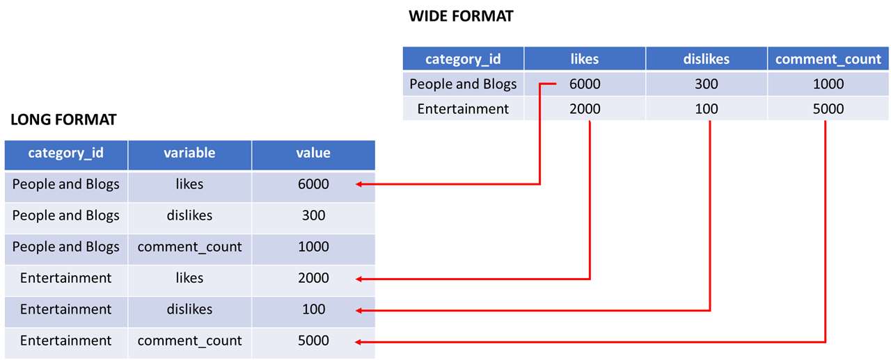

```{r setup, include=FALSE}
# clean up the environment
rm(list = ls())

# setup chunk options
knitr::opts_chunk$set(
  message = FALSE,
  warning = FALSE,
  cache = TRUE,
  fig.align = "center",
  comment = "#>"
)

options(scipen = 9999)
```

<style>
body {
text-align: justify}
</style>

Materi ini diproduksi oleh tim dari Algoritma untuk topik ***Unveiling Socio Demographic Patterns: Exploring Data Panels with plm() in R***. Materi berikut hanya ditujukan untuk kalangan terbatas, meliputi individu/personal yang menerima materi ini secara langsung dari lembaga pelatihan. Materi ini dilarang untuk direproduksi, didistribusikan, diterjemahkan, atau diadaptasikan dalam bentuk apapun di luar izin dari individu dan organisasi yang berkepentingan.

**Algoritma** adalah pusat pendidikan Data Science di Jakarta. Kami mengadakan workshop dan program pelatihan untuk membantu para profesional dan pelajar untuk mendapatkan keahlian dalam berbagai bidang dalam ruang lingkup *Data Science*: *data visualization*, *machine learning*, *data modeling*, *statistical inference*, dan lain-lainnya.

Sebelum masuk ke dalam materi dan menjalankan kode-kode di dalam materi ini, silakan anda melihat bagian ***Library and Setup*** untuk melihat dan memastikan semua persyaratan dasar untuk mengikuti materi ini sudah terpenuhi termasuk *package-package* yang diperlukan. Pada bagian **Tujuan Pembelajaran** anda dapat melihat secara umum apa saja yang akan dipelajari dalam modul materi ini. Kami harap materi ini akan bermanfaat bagi karir ataupun menambah keahlian peserta.

***

# Pendahuluan {.tabset}

## Kata Pengantar

Dalam era digital saat ini, data telah menjadi komoditas yang sangat berharga, memperkuat pemahaman kita tentang berbagai aspek kehidupan manusia, termasuk faktor sosial dan demografi.Informasi *socio demografi* memungkinkan kita untuk memahami karakteristik individu dan kelompok dalam suatu populasi. Data mengenai usia, jenis kelamin, pendidikan, dan status ekonomi membantu dalam membentuk gambaran yang lebih lengkap tentang dinamika sosial masyarakat. Dengan pemahaman yang lebih baik tentang faktor-faktor ini, kita dapat mengidentifikasi tren, pola, dan perubahan yang terjadi dari waktu ke waktu.

Salah satu metode yang dapat Kita gunakan untuk melacak perkembangan sosial dan demografi adalah ***Panel Data Analysis***. Dengan analisis data panel memungkinkan kita untuk memahami bagaimana faktor-faktor socio demografi berinteraksi dan berdampak satu sama lain seiring berjalannya waktu. Analisis data panel memungkinkan kita untuk mengeksplorasi hubungan kausalitas antara berbagai variabel socio demografi, serta untuk mengidentifikasi faktor-faktor yang mempengaruhi perubahan dalam jangka panjang

Materi ini bertujuan memberikan pemahaman kepada peserta workshop terkait penggunaan ***Panel Data analysis*** dalam mengeksplorasi data Socio demografi. Adapun setelah mempelajari materi ini peserta diharapkan dapat memahami kegunaan dan potensi *panel data analysis* sesuai dengan proses bisnis yang ada di bidang industri yang dijalani oleh peserta.

***

## Tujuan Pembelajaran

Tujuan utama dari workshop ini adalah untuk memberikan pengenalan yang komprehensif mengenai tools dan perangkat lunak yang digunakan untuk melakukan *panel data analysis*, yakni sebuah open-source populer: R. Adapun materi ini akan mencakup:


- **Dasar Bahasa Pemrograman R**      
    - Pengenalan R untuk *data science*
    - Lingkunan kerja RStudio
    - Basic Control Statement di R
    - Manipulasi dan pemrosesan data dengan R dplyr
    
- **Pengenalan Socio Demografi & Data Panel**
    - Pengenalan data socio demografi
    - Pengenalan data panel
    - Konsep dan alur pemodelan data panel

- **Case Study: Pemodelan Persentase Tingkat Pengangguran di Pulau Jawa Tahun 2015-2018**
    - Persiapan data panel
    - Explorasi Data
    - Pembuatan model data panel
    - Pemilihan model terbaik
    - Pengujin Asumsi
    - Interpretasi model
    - Prediksi data baru

***

# Perkenalan Tools {.tabset}

Sebelum masuk ke dalam analisis data, kita perlu mengenal tools dan bahasa pemrograman yang akan digunakan. Adapun dalam workshop ini, bahasa pemrograman yang digunakan pada workshop ini yaitu R dengan bantuan tools yaitu RStudio.  

R merupakan bahasa pemrograman di mana seperangkat instruksi akan diterjemahkan ke dalam bahasa komputer, sedangkan RStudio merupakan aplikasi tambahan yang dapat membantu pengguna R melakukan pekerjaannya. 

```{r fig.width=5, echo=FALSE}
knitr::include_graphics(path = "assets/rstudio.png")
```

## Mengapa mempelajari R?

**1. Dibangun oleh ahli statistik, untuk ahli statistik.**      

R adalah bahasa pemrograman statistik yang dibuat oleh *Ross Ihaka* dan *Robert Gentleman* di Departemen Statistik, di University of Auckland (Selandia Baru). R dibuat untuk analisis data, dan dengan demikian, berbeda dari bahasa pemrograman tradisional. R bukan hanya bahasa pemrograman statistik, R juga environment yang lengkap untuk analis data dan perangkat lunak analisis data yang paling banyak digunakan saat ini.     

**2. Memiliki banyak Library**     

R menyediakan banyak packages tambahan yang menambahkan fungsionalitas out-of-the-box untuk berbagai kegunaan: uji statistik, analisis deret waktu, visualisasi yang indah, dan berbagai tugas machine learning seperti algoritme regresi, algoritme klasifikasi, dan algoritme clustering. Komunitas R terkenal karena kontribusinya yang aktif dalam hal packages.      

**3. Sumber Terbuka**      

Bagian dari alasan komunitasnya yang aktif dan berkembang pesat adalah sifat sumber terbuka (open-source) dari R. Pengguna dapat berkontribusi dalam pembuatan packages, banyak tools statistik dan template kustomisasi untuk visualisasi yang tidak ditemukan dalam aplikasi statistik lain. 

**4. Digunakan oleh berbagai perusahaan perangkat lunak Terbesar di Dunia**      

R digunakan oleh Google untuk menghitung Return on Investment (ROI) dari berbagai iklan, dan seringkali digunakan untuk mengestimasi _casual effect_; seperti estimasi dampak dari sebuah fitur dari suatu aplikasi terhadap jumlah _download_ dari aplikasi tersebut, ataupun peningkatan tingkat penjualan setelah mengeluarkan _AdWords_. Bahkan, Google merilis _package_ R yang dapat digunakan oleh pengguna R lain untuk melakukan analisis serupa (lihat [`CausalImpact`](https://opensource.googleblog.com/2014/09/causalimpact-new-open-source-package.html){target="_blank"}). Banyak pegawai di Google telah berkontribusi aktif terhadap komunitas pengguna R: mereka seringkali aktif dalam berbagai grup pengguna R; [membuat _interface_ untuk _Google Prediction_](https://code.google.com/archive/p/google-prediction-api-r-client/){target="_blank"}; [membuat _coding style_ versi Google untuk R](http://web.stanford.edu/class/cs109l/unrestricted/resources/google-style.html){target="_blank"}, dan telah berkontribusi berbagai _package_ untuk R.
    
   
**Microsoft** juga termasuk sebagai salah satu diantara perusahaan besar yang sangat bergantung pada R. Pada awalnya, Microsoft menggunakan R dalam: _platform_ Azure--tepatnya sebagai _capacity planning_; sistem _matchmaking_ pada Xbox's TrueSkill; analisis _churn_ untuk berbagai produk; dan beberapa _internal services_ lain dalam [Microsoft's line of products](http://blog.revolutionanalytics.com/2015/06/r-at-microsoft.html){target="_blank"}. Langkah penting yang diambil oleh Microsoft dalam hal ini adalah akuisisi dari _Revolution Analytics_, yang terkenal atas berbagai produk perkembangan di R; yang sekarang lebih dikenal sebagai _Microsoft R Server_, _Microsoft R Open_, _Microsoft Data Science Virtual Machine_, dll.   
    
    
**5. Ready for Big Data**     

R dapat terintegrasi dengan tools lain dalam pengolahan big data, library seperti RHadoop, ParallelR, merupakan sebagian dari library yang mampu membantu data engineers untuk melakukan komputasi pararel di R. 

***

## R Studio UI
Pada awal materi kita telah membahas perbedaan utama antara R dan RStudio. RStudio memiliki beberapa panel yang tersedia, jika anda sedang membaca materi ini pada format file RMarkdown (.Rmd), anda sedang melihat panel source dari RStudio. Sekarang mari kita bahas beberapa panel yang terdapat pada RStudio :

```{r}
knitr::include_graphics("assets/Rstudio UI.png")
```


Terdapat 4 panel utama yang harus Anda pahami yaitu:

1. **Panel Source**: Jendela yang menampilkan file yang sedang dibuka pada RStudio (fitur utama).

2. **Panel Console**: Jendela yang menampilkan eksekusi dari bahasa R yang digunakan untuk berkomunikasi dengan R Session.

3. **Panel Environment / History**: Jendela yang menampilkan seluruh object R yang sudah dibuat selama session yang sama. Tab History berfungsi untuk melihat history dari kode yang sudah dijalankan sebelumnya

4. **Panel Files/Plot/Packages/Help**:

- Tab Files    : Daftar dari file yang berada dalam working directory yang dibuka (satu R project).
- Tab Plot     : Menampilkan visualisasi yang terbentuk.
- Tab Packages : Berisi daftar packages yang sudah terinstall.
- Tab Help     : Menampilkan dokumentasi resmi dari setiap fungsi dapat membantu pemahaman terkait fungsi tersebut.

Materi ini dibuat menggunakan R markdown file (.Rmd) yang sudah terintegrasi dengan RStudio dan beberapa fitur sudah diatur dalam packages `rmarkdown`. R markdown dapat digunakan untuk membuat laporan dari analisa dengan standar yang tinggi. Jika Anda melihat lokasi original dari file ini maka Anda akan menemukan 3 file utama yaitu : file .Rmd, .html, dan .pdf. Adapun file HTML dan PDF dihasilkan dari R markdown dengan fungsi `knit` dari packages `rmarkdown.`

Pada R markdown Anda dapat memasukkan narasi dari laporan yang dibuat serta kode program dari analisis Anda. Adapun tempat untuk memasukkan kode program pada R markdown disebut chunk. Terdapat 2 cara untuk membuat chunk yaitu :     

1. menggunakan shortcut `ctrl` + `alt` + `i`     
2. menggunakan tombol insert yang berada pada pojok kanan atas dari panel source kemudian pilih R     

***
## Library/Package

_Package_ adalah kumpulan fungsi R, data, dan kode yang dikompilasi dalam format yang terdefinisi dengan baik. Direktori tempat penyimpanan paket disebut library. 

Untuk dapat mengikuti materi ini, peserta diharapkan sudah menginstall beberapa packages di bawah ini. Apabila package tersebut belum terinstall, silahkan melakukan instalasi package dengan copy dan jalankan code berikut pada bagian _console_

> install.packages(c("knitr", "rmarkdown", "dplyr","tidyr","lubridate", "ggcorplot", "ggplot2", "gplots", "foreign", "kableExtra", "plotly","plm","lfe","lmtest","car","tseries","MLmetrics"))

Apabila package sudah terinstall, silahkan jalankan code dibawah ini untuk mengaktifkan package-package yang akan digunakan pada materi ini.

```{r}
#Packages untuk pengolahan dataframe
library(dplyr)
library(tidyr)
library(lubridate)

#Packages untuk reporting
library(kableExtra)

#Packages untuk membuat visualisasi
library(ggcorrplot)
library(gplots)
library(ggplot2)
library(plotly)
library(foreign)

#Packages untuk melakukan analisis
library(plm)
library(lfe)
library(lmtest)
library(car)
library(tseries)
library(MLmetrics)
```

***

## Membuat Report dengan Rmarkdown

Pada materi ini, kita akan menggunakan file Rmarkdown (.Rmd). Rmarkdown merupakan package/tools yang digunakan untuk membuat report dengan kualitas tinggi.Pada folder materi ini terdapat file dengan ekstensi `.html` yang merupakan hasil *knit* dari Rmarkdown.

Untuk membuat file Rmarkdown, kita bisa klik menu file pada pojok kiri atas Rstudio, pilih `New File` dan pilih `R Markdown`. Window baru akan terbuka, anda dapat memilih output dari report yang diinginkan kemudian memasukkan nama serta judul dari report.

```{r echo=FALSE}
knitr::include_graphics("assets/rmarkdown.png")
```

***

## Shortcut

Terdapat beberapa *key shortcut* yang akan memudahkan anda dalam menggunaan R. Beberapa diantaranya yaitu:

* `Alt  + -`            : assign/ membuat objek di R (<-)
* `Ctrl + Shift+ M`     : membuat simbol piping (%>%) 
* `Ctrl + Enter`        : Menjalankan satu baris kode
* `Ctrl + Shift + Enter`: Menjalankan seluruh baris kode dalam chunk

***


# Dasar Pemrograman di R

## Variabel dan Penugasan

Seperti yang telah kita sebutkan sebelumnya, R adalah salah satu alat paling populer dalam bekerja dengan data. Di R, Anda akan menyimpan data dalam objek R. Objek tersebut disimpan di dalam memori untuk setiap sesi R dan disimpan dengan nama yang ditugaskan. Berikut adalah contoh pembuatan objek R:

```{r}
# Please run the code down below
alamat <- "Algoritma Data Science School, Jl. H. R. Rasuna Said No.Kav. 2-3, Kuningan Tim., Kecamatan Setiabudi, Kota Jakarta Selatan"
```

Jika Anda menjalankan chunk di atas, Anda akan melihat variabel yang baru dibuat dalam jendela lingkungan yang disebut `alamat`. Dengan cara ini, kita dapat dengan mudah memanggil setiap objek yang telah kita buat menggunakan nama variabel:

```{r}
alamat
```


***

## Variabel Kelas

Bentuk dasar objek R adalah vektor. Dalam matematika, vektor digunakan untuk menunjukkan besaran dan arah, yang juga diimplementasikan dalam R. Objek `alamat` sebelumnya menyimpan nilai: "Algoritma Data Science School, Jl. H. R. Rasuna Said No.Kav. 2-3, Kuningan Tim., Kecamatan Setiabudi, Kota Jakarta Selatan" dan menyimpan nilai tersebut sebagai **kelas karakter**. Ada 4 variabel kelas dasar dalam R:

```{r}
# character
a_char <- c("Jawa Barat", "Jawa Tengah", "Jawa Timur")

# numeric
a_num <- c(-1, 1, 2, 3/4, 0.5)

# integer
an_int <- c(1L, 2L)

# logical
a_log <- c(TRUE, TRUE, FALSE)

```

- `Tipe data character` : Tipe data yang berisi huruf/karakter.
- `Tipe data factor` : Factor merupakan bentuk perkembangan dari character, yang membedakan character dan factor adalah objek factor memiliki levels dan pengulangan. Digunakan untuk tipe data kategorikal.
- `Tipe data numeric`:  Tipe data berisi angka yang dapat berupa angka kontinu (ada koma/pecahan), maupun diskrit (bilangan bulat tanpa koma).
- `Tipe data integer`: Tipe data berisi angka yang berupa angka diskrit (bilangan bulat tanpa koma). Untuk memaksa numeric menjadi integer, dapat gunakan L dibelakang angka.
- `Tipe data logical`: Tipe data yang hanya berisi TRUE atau FALSE. Penulisan TRUE/FALSE dapat disingkat menjadi T/F.

Cara untuk mengetahui tipe data dari suatu objek, Anda dapat menggunakan fungsi `class()`
```{r eval=FALSE}
# Lengkapkan kode di bawah ini
class(a_char)
```

Lalu, apa yang akan terjadi jika dalam satu vector memiliki beberapa tipe data yang berbeda seperti chunk dibawah ini?

```{r}
mix <- c(TRUE, 1L, 3, 4/5, "Algoritma")
mix
```

Bila Anda perhatikan pada output vector `mix` setiap nilai memiliki tanda **petik dua**, artinya nilai tersebut merupakan sebuah objek dengan tipe character. Proses perubahan tipe data paksa dari suatu vector bisa disebut sebagai _**implicit coercion**_. Ilustrasi terjadinya implicit coercion dapat dilihat pada gambar di bawah ini:
```{r}
knitr::include_graphics("assets/level_data.png")
```
Gambar diatas menunjukkan hierarki kelas objek R dari yang paling khusus (paling dalam) hingga yang paling umum (paling luar). Pemaksaan implisit akan mengikuti aturan transformasi nilai menjadi yang paling umum, yang berarti vektor sebelumnya dari `c(TRUE, 1L, 3, 4/5, "Algoritma")` akan dipaksa menjadi yang paling umum, dalam hal ini, (____):

```{r}
# Your code here
class(mix)
```


> **Knowledge Check 1**:

Berdasarkan pemahaman Anda tentang kelas vektor dan pemaksaan implisit, apa yang Anda pikirkan tentang kelas vektor berikut?

- `c(TRUE, "TRUE", 1, 1L)`    : character
- `c(FALSE, 0L, TRUE, 1)`     : numeric
- `c(FALSE, 0L, FALSE, TRUE)` : integer

```{r}
class(c(TRUE, "TRUE", 1, 1L))
class(c(FALSE, 0L, TRUE, 1))
class(c(FALSE, 0L, FALSE, TRUE))
```

## Objek Data Frame

Setelah kita mempelajari tentang **vektor** dan **kelas**, kita akan membahas tipe objek lainnya. Pertimbangkan kasus ini:
  
*Anda bekerja di perusahaan e-commerce dan diberikan data faktur dari tahun 2020 dalam format tabel. Bisakah Anda membayangkan seperti apa data tersebut? Bagaimana Anda akan menyimpan datanya?*

Sebuah **data frame** adalah cara paling umum untuk menyimpan data di R, dan jika digunakan secara sistematis, membuat analisis data lebih mudah. Di bawah kecapi, sebuah data frame adalah *daftar* dari vektor yang memiliki panjang yang sama. Sekarang, mari kita lihat contoh data frame di bawah ini:

```{r}
# Please run the code down below
faktur <- data.frame(
 faktur.id = 1005:1009,
 jumlah.pembelian = c(560400, 701300, 350300, 421600,321000),
 tanggal.pembelian = as.Date(c("2020-01-02","2020-01-02","2020-01-02","2020-02-03","2020-02-03")),
 nama.pelanggan = c("Shello", "Ardhito", "Arlene", "Bagas", "Cipto"),
 alamat = factor(c("Denpasar", "Bogor", "Jakarta", "Surabaya", "Jakarta"))
)

faktur
```

> **Knowledge Check 2**:

1. Ingat cara menggunakan `class()` untuk mengembalikan atribut kelas dari objek R. Buat chunk baru di bawah ini, dan gunakan panggilan fungsi pada `faktur`!

```{r}
# Type your code here
class(faktur)
```
2. Untuk mengakses kolom dari data frame, Anda dapat menggunakan sintaks `data$kolom`. Cobalah menggunakan fungsi `class()` pada `faktur$alamat`, nilai apa yang dikembalikan oleh panggilan fungsi tersebut? Bagaimana dengan `faktur$jumlah.pembelian`?

```{r}
# Type your code here
class(faktur$jumlah.pembelian)
```

***
## Exploratory Data Analysis

**1. Membaca Data**

Pada bagian sebelumnya, kita telah mempelajari struktur data di R. Untuk selanjutnya kita akan mencoba melakukan import data menggunakan fungsi `read.csv()`. Data yang akan kita gunakan adalah `penganguran.csv` yang merupakan data tingkat pengangguran provinsi di Indonesia dari tahun 2015 s.d 2018 yang sudah tersedia dalam folder `data_input`.

```{r}
# membaca data pengangguran.csv
read.csv("data_input/penganguran.csv")
```
dari hasil pembacaan data diatas, terlihat bahwa data terbaca menjadi 1 kolom. hal ini bisa kita atasi dengan memberikan parameter `sep= ";"` untuk menunjukkan bahwa data `pengangguran.csv` memiliki separator `;`dan menambahkan parameter `check.names = F` agar informasi kolom yang berupa angka tidak memunculkan tanda X. 

```{r}
# membaca dan menyimpan data pengangguran.csv
pengangguran <- read.csv("data_input/penganguran.csv",sep= ";",check.names = F)
```

**2. Menampilkan Data**

Untuk dataset yang relatif kecil seperti ini, Anda masih dapat melihat CSV lengkap dalam format mentahnya melalui perintah `View(pengangguran)`, atau dengan mengklik ikon "spreadsheet" di sebelah data yang ingin Anda inspeksi dalam jendela environtment. Tetapi, saya tidak merekomendasikan Anda menggunakan perintah `View()`, karena dalam kehidupan nyata Anda tidak selalu tahu sebelumnya ukuran data, dan pada umumnya melihat beberapa baris data awal sudah cukup untuk mendapatkan gambaran informasi data.

Untuk melihat 6 observasi pertama, kita bisa melakukannya dengan menggunakan fungsi `head(nama objek)`. Kita dapat menambahkan parameter tambahan, `n`, sehingga fungsi tersebut akan mengembalikan n baris pertama dari data. apabila parameter n tidak diisi, secara default akan menampilkan sebanyak 6 baris data. Sebagai contoh mari kita tampilkan 6 baris data pertama dari data pengangguran : 

```{r}
## Your code here
head(pengangguran)
```

Note: apabila ingin menampilkan 6 observasi terakhir, kita dapat menggunakan fungsi `tail()`

**3. Pemeriksaan Struktur Data**

Untuk mengetahui tipe data dari masing masing kolom yang ada. Kita bisa menggunakan fungsi `str()` untuk melihat struktur serta dimensi dari data. 

> **Knowledge Check 3**:

Lakukan pemeriksaan struktur data dengan fungsi `str()` pada dataset `pengangguran`, kemudian Tinjau output dari `str()` di atas dan jawab pertanyaan berikut:

- Berapa jumlah baris data yang kita miliki dalam dataset pengangguran?
- Berapa jumlah kolom yang ada dalam dataset pengangguran?
- Apakah setiap variabelnya memiliki kelas yang tepat?

```{r}
## Your code here
str(pengangguran)
```
Berdasarkan pemeriksaan struktur data diatas:

- data pengangguran memiliki sebanyak 35 baris dan 5 kolom
- kelas untuk setiap kolom sudah sesuai


## Data transformation using dplyr

**`dplyr`** merupakan library/package khusus yang mempermudah kita dalam melakukan data wrangling/cleaning/transformation. Tahapan data wrangling yang umum:

- cek data
- seleksi kolom
- filter baris
- membuat/mengubah kolom

### 🛠 `glimpse`: cek struktur data

fungsi `glimpse` memiliki kegunaan yang sama dengan fungsi `str()` namun memiliki tampilan informasi yang lebih rapih dan

- *Rows*    : jumlah baris
- *Columns* : jumlah kolom
- *nama kolom*
- *tipe data*
- *isi kolom*

```{r eval=FALSE}
# Please type your code here
# base
str(pengangguran)
```

```{r}
# Please type your code here
library(dplyr)
glimpse(pengangguran)
```

### 🛠 `select` : seleksi kolom

fungsi `select` digunakan untuk mengambil atau membuang kolom tertentu dari data.

❓Misalkan kita ingin mengambil kolom `2015` & `2016`:

```{r eval=FALSE}
# base objek[baris,kolom]
pengangguran[ , c("2015", "2016") ] 

```

**dplyr: `select(data, kolom yg ingin diambil/dibuang)`**

```{r}
# Please type your code here
# dplyr
select(pengangguran, Provinsi,"2015","2016")
```

❓M isalkan kita ingin buang kolom `2015`,dan `2016``

```{r eval=FALSE}
# base: harus menggunakan index
pengangguran[,-c(2,3)]
```

```{r}
# Please type your code here
# dplyr
select(pengangguran, -"2015",-"2016")
```
Note:

- untuk selesksi kolom dapat menggunakan fungsi `select()` dengan parameter `.data` , `nama kolom`
- untuk drop kolom dapat menggunakan fungsi  `select()`dengan parameter `.data`, `-nama kolom`


### 🛠 `filter`: filter baris (berdasarkan kondisi)

Fungsi `filter` digunakan untuk mengambil data dengan kondisi tertentu berdasarkan baris data. Misalkan kita ingin mengambil data dari Provinsi *"Aceh"* dan *"Jawa Barat"*


```{r eval=FALSE}
# base objek[baris,kolom]
pengangguran[pengangguran$Provinsi == "ACEH" | pengangguran$Provinsi == "JAWA BARAT",]

```

```{r}
# Please type your code here
# dplyr
filter(pengangguran,Provinsi %in% c("ACEH","JAWA BARAT"))
```

### 🛠 `mutate`: memodifikasi kolom

fungsi mutate dapat digunakan untuk:

- mengubah tipe data, 
- menambah kolom, 
- mengganti nilai pada suatu kolom

```{r eval=FALSE}
# base: mengubah tipe data kolom `Provinsi`
pengangguran$Provinsi <- as.factor(pengangguran$Provinsi)
glimpse(pengangguran)
```

**dplyr: `mutate(data, nama kolom = isi kolom)`**

```{r}
# Please type your code here
# dplyr
mutate(pengangguran,
       Provinsi = as.factor(Provinsi),
       status = "mengkhawatirkan",
       "2015" = 0)
```

***

### 🛠 Piping `%>%`

R dilengkapi dengan berbagai alat bawaan yang dapat membantu kita melakukan semua operasi tersebut, tetapi dalam bagian ini, kita akan menggunakan fungsi yang disediakan oleh `dplyr` dari paket `tidyverse` sebagai pertimbangan bahasa yang ditawarkan oleh `dplyr` selalu lebih intuitif dan mudah dibaca. Dalam sesi pengantar ini, kita akan membahas 5 fungsi `dplyr` yang paling umum digunakan. Simbol `%>%` digunakan untuk menyambungkan proses yang sequential atau berurutan dari setiap fungsi yang kita gunakan.

Sebagai gambaran konsep piping: saya dari bangun tidur ingin pergi ke suatu tempat, kegiatan apa saja yang saya lakukan?

1. bangun
2. mandi
3. ganti baju
4. makan
5. siap-siap pergi
6. pergi

Pada R base untuk menjalankan fungsi saling sambung perlu memasukkan fungsi pertama yang dijalankan dan diletakkan paling dalam, sedangkan fungsi yang terakhir dijalankan dan diletakkan paling depan.

1. mandi
2. ganti_baju
3. makan
```{r eval=FALSE}
makan(ganti_baju(mandi(yusraf)))
```

Jika kita terapkan dalam sebuah fungsi dan code, anggap beberapa fungsi yang kita miliki adalah:

* bangun()
* mandi()
* ganti_baju()
* makan()
* siap_pergi()
* pergi()

Maka jika kita ingin pergi dan mengaplikasikan dari beberapa fungsi serta step diatas:

* tanpa piping
```{r eval=FALSE}
pergi(siap_pergi(makan(ganti_baju(mandi(bangun(saya))))))
```

Jika kita menggunakan piping ( `%>%` ):

* shortcut untuk membuat piping ( `%>%` ) -> ctrl+shift+m / command + shift + m

```{r eval=FALSE}
saya %>% 
  bangun() %>% 
  mandi() %>% 
  ganti_baju() %>% 
  makan() %>% 
  siap_pergi() %>% 
  pergi()
```
**Shortcut Piping**: `CTRL+ SHIFT + M` / `CMD + SHIFT + M`

**Piping** membuat penggabungan tahapan wrangling di atas menjadi lebih mudah.

Sebagai contoh, berikut kita coba melakukan pemrosesan data dengan tahapan berikut:

1. Buang kolom `check`
2. Ubah tipe data Provinsi kembali menjadi character
3. Ambil data provinsi yang berada di pulau Jawa
   - BANTEN, 
   - DKI JAKARTA, 
   - JAWA BARAT, 
   - JAWA TENGAH, 
   - DI YOGYAKARTA, 
   - JAWA TIMUR

```{r eval=F}
# base
# drop kolom check
P_JAWA <- pengangguran

# mengubah tipe data provinsi
P_JAWA$Provinsi <- as.character(P_JAWA$Provinsi)

# mengambil data provinsi di pulau jawa
P_JAWA <- P_JAWA[P_JAWA$Provinsi == "BANTEN" |
                   P_JAWA$Provinsi == "DKI JAKARTA" |
                   P_JAWA$Provinsi == "JAWA BARAT" |
                   P_JAWA$Provinsi == "JAWA TENGAH" |
                   P_JAWA$Provinsi == "DI YOGYAKARTA" |
                   P_JAWA$Provinsi == "JAWA TIMUR",]

P_JAWA

```

```{r}
# dengan dplyr dan metode piping
P_JAWA2 <- pengangguran %>% 
  # select(-check) %>% 
  mutate(Provinsi = as.character(Provinsi)) %>% 
  filter(Provinsi %in% c("BANTEN","DKI JAKARTA","JAWA BARAT","JAWA TENGAH","DI YOGYAKARTA","JAWA TIMUR"))

P_JAWA2
```

## Reshaping data

`pivot_longer()` dan `pivot_wider()` merupakan dua fungsi dari package `tidyr` yang biasa digunakan untuk melakukan reshaping data. 

### pivot_longer()

Fungsi `pivot_longer()` memungkinkan kita untuk membentuk ulang sebuah dataframe yang awalnya memiliki format *wide* (tersebar secara horizontal) menjadi *long* (dikumpulkan secara vertikal). Prinsip format *wide* dan *long* dapat diilustrasikan dengan gambar berikut ini.


```{r echo=FALSE, out.width="100%"}

```

Parameter fungsi `pivot_longer()`

* `data`     : objek data
* `cols`     : kolom yang ingin diubah menjadi format **long**
* `names_to` : nama kolom baru yang berisi nama-nama kolom sebelumnya yang dimasukkan di parameter `cols`
* `values_to`: nama kolom baru yang berisi nilai-nilai numerik

Dari dataset yang kita miliki (**P_JAWA2**) , kita akan coba mengubah format datanya menjadi long format seperti gambar berikut:

```{r}
knitr::include_graphics("assets/pivot_longer.png")
```

```{r}
# your code here
long_jawa <- P_JAWA2 %>% pivot_longer(cols = c("2015","2016","2017","2018"),
                         names_to = "Tahun",
                         values_to = "Tingkat_Pengangguran") %>% 
  mutate(Tahun = as.factor(Tahun))

glimpse(long_jawa)
```
### pivot_wider()

Fungsi `pivot_wider()` merupakan kebalikan dari fungsi `pivot_longer()` yang memungkinkan kita untuk membentuk ulang sebuah dataframe berformat *long* (tersebar secara vertikal) menjadi *wide* (dikumpulkan secara horizontal)

Sebelumnya kita sudah berhasil melakukan *reshaping* data menjadi format long yang tersimpan pada objek **long_jawa**. Sekarang mari kita coba kembalikan ke format wide dengan menggunakan fungsi `pivot_wider()`

Parameter pada fungsi `pivot_wider()` 

* `data`        : object data 
* `names_from`  : parameter ini untuk memberi tahu fungsi kolom apa yang mewakili data yang ingin kita buat menjadi wide 
* `values_from` : parameter ini untuk memberi tahu fungsi kolom apa yang mewakili data numerik

Dari dataset yang telah kita ubah menjadi long format(**long_jawa**) , kita akan coba mengembalikannya menjadi wide format
```{r}
# your code here
long_jawa %>% pivot_wider(
  names_from = Tahun, 
  values_from = Tingkat_Pengangguran)
```

# Dive Deeper

Pada data _Proporsi Remaja Dan Dewasa Usia 15-59 Tahun Dengan Keterampilan Teknologi Informasi Dan Komputer (TIK) Menurut Provinsi tahun 2015 s.d 2018_ yang tersimpan pada file `TIK.csv`lakukanlah transformasi data berikut:

1. Baca data dan simpan kedalam objek `TIK`
2. Ambil data provinsi yang berada di pulau Jawa
   - BANTEN, 
   - DKI JAKARTA, 
   - JAWA BARAT, 
   - JAWA TENGAH, 
   - DI YOGYAKARTA, 
   - JAWA TIMUR
3. Ubah menjadi long format
4. Sesuaikan tipe data setiap variabel

```{r}
# code kak safira
TIK <- read.csv("data_input/TIK.csv", sep =";", check.names = F)
 
TIK_Jawa <-  TIK[TIK$Provinsi == "BANTEN" |
        TIK$Provinsi == "DKI JAKARTA" |
        TIK$Provinsi == "JAWA BARAT" |
        TIK$Provinsi == "JAWA TENGAH" |
        TIK$Provinsi == "DI YOGYAKARTA" |
        TIK$Provinsi == "JAWA TIMUR",] %>%
  
        pivot_longer(cols = c("2015", "2016", "2017", "2018"),
                     names_to = "Tahun",
                     values_to = "Proporsi_Keterampilan_TIK") %>% 
        
        mutate(Provinsi = as.factor(Provinsi),
               Tahun = as.factor(Tahun))

TIK_Jawa
```
```{r}
#code Ahmad Sirullah
TIK <- read.csv("data_input/TIK.csv", sep = ";", check.names = F)

TIK %>%
  filter(
    Provinsi %in% c(
      "BANTEN",
      "DKI JAKARTA",
      "JAWA BARAT",
      "JAWA TENGAH",
      "DI YOGYAKARTA",
      "JAWA TIMUR"
    )
  ) %>%
  pivot_longer(
    cols = c("2015", "2016", "2017", "2018"),
    values_to = "Proporsi_Ketrampilan",
    names_to = "Tahun"
  ) %>%
  mutate(Tahun = as.factor(Tahun))
```
```{r}
read.csv("data_input/TIK.csv", sep = ";", check.names = F) %>%
  filter(
    Provinsi %in% c(
      "BANTEN",
      "DKI JAKARTA",
      "JAWA BARAT",
      "JAWA TENGAH",
      "DI YOGYAKARTA",
      "JAWA TIMUR"
    )
  ) %>%
  pivot_longer(
    cols = c("2015", "2016", "2017", "2018"),
    values_to = "Proporsi_Ketrampilan",
    names_to = "Tahun"
  ) %>%
  mutate(Tahun = as.factor(Tahun))
```

# Summary Day 1

1. Data Socio Demografi data yang memuat informasi mengenai perilaku atau karakteristik individu di suatu wilayah, contoh
   - gender
   - usia
   - tingkat pendidikan
   - pendapatan
   
2. Data Panel 
   - susunan : informasi index dan informasi variabel (targe & prediktor)
   - Struktur data : memiliki format pooled data frame, menggabungkan data cross sectional dengan data time series
   - kegunaan/manfaat : untuk menganalisa faktor-faktor yang mempengaruhi target berdasarakan informasi individu dan waktu
   
3. Tipe Data
   - `Char` : sebuah objek yang berisi teks
   - `num`  : sebuah objek yang berisi bilangan bulat dan bilangan pecahan
   - `int`  : sebuah objek yang berisi bilangan bulat
   - `log`  : sebuah objek yang berisi nilai logika (T or F)
   
4. import data
   - `Sep`         : menginformasikan pemisah antar kolom pada data csv
   - `check.names=F` : menginformasikan agar mengabaikan penulisan nama kolom yang menggunakan angka, sehingga tidak muncul tambahan karakter `X` pada nama kolom
   
5. dplyr
   - `glimpse` : memeriksa kelas data
   - `select`  : mengambil atau drop kolom tertentu
   - `filter`  : mengambil baris sesuai kondisi yang dibutuhkan
   - `mutate`  :
     + mengubah tipe data
     + membuat kolom baru
     + mengganti nilai suatu kolom
   - `piping` : sebuah konsep untuk menjalankan kode dengan secara sequential atau berurutan, menggunakan tanda %>%
   
6. reshaping data
   - wide to long : `pivot_longer`
   - long to wide : `pivor_wider`

# Reference

1. Dataset [BPS RI](https://www.bps.go.id/id)

2. [Principles of Econometrics with  R](https://bookdown.org/ccolonescu/RPoE4/)

3. [Panel data Econometrics in R ](https://cran.r-project.org/web/packages/plm/vignettes/A_plmPackage.html)

4. [Liniear Model for Panel Data](https://cran.r-project.org/web/packages/plm/plm.pdf)

5. [Panel data using R](https://www.princeton.edu/~otorres/Panel101R.pdf)