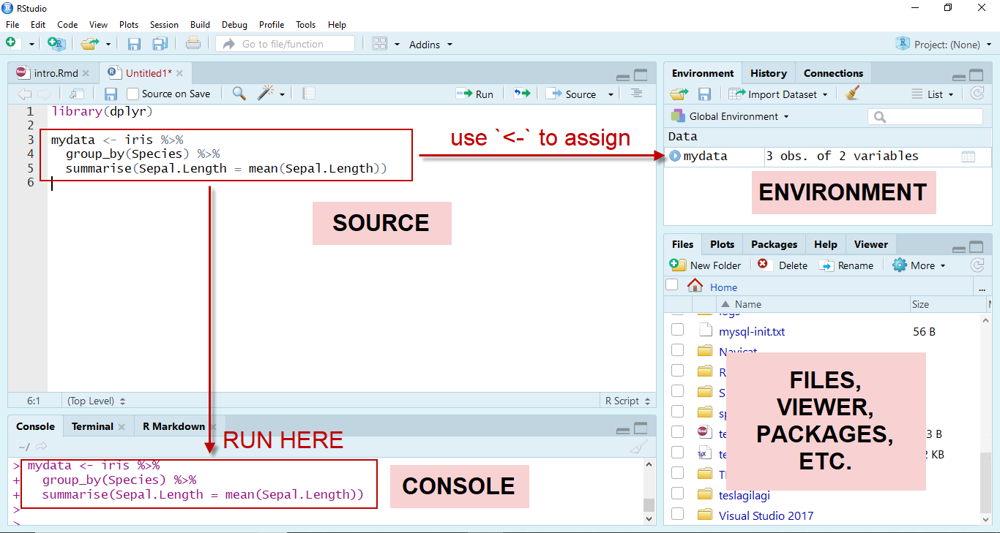
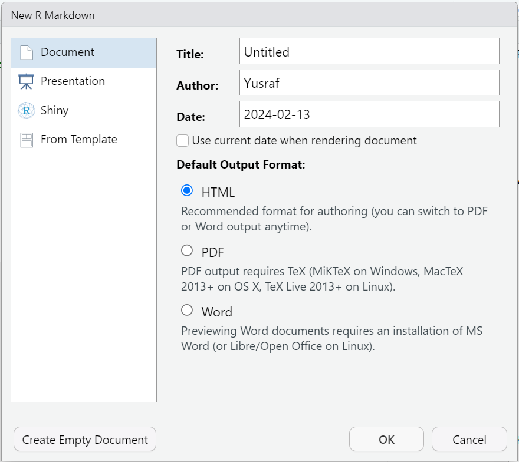
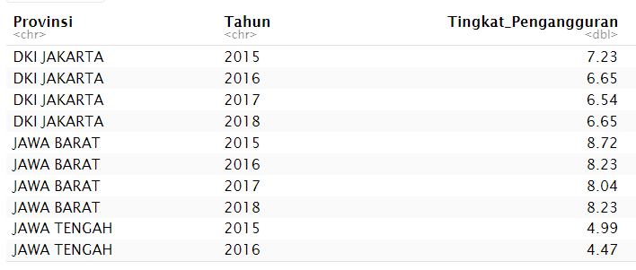

```{r setup, include=FALSE}
# clean up the environment
rm(list = ls())

# setup chunk options
knitr::opts_chunk$set(
  message = FALSE,
  warning = FALSE,
  cache = TRUE,
  fig.align = "center",
  comment = "#>"
)

options(scipen = 9999)
```

<style>
body {
text-align: justify}
</style>

Materi ini diproduksi oleh tim dari Algoritma untuk topik ***Unveiling Socio Demographic Patterns: Exploring Data Panels with plm() in R***. Materi berikut hanya ditujukan untuk kalangan terbatas, meliputi individu/personal yang menerima materi ini secara langsung dari lembaga pelatihan. Materi ini dilarang untuk direproduksi, didistribusikan, diterjemahkan, atau diadaptasikan dalam bentuk apapun di luar izin dari individu dan organisasi yang berkepentingan.

**Algoritma** adalah pusat pendidikan Data Science di Jakarta. Kami mengadakan workshop dan program pelatihan untuk membantu para profesional dan pelajar untuk mendapatkan keahlian dalam berbagai bidang dalam ruang lingkup *Data Science*: *data visualization*, *machine learning*, *data modeling*, *statistical inference*, dan lain-lainnya.

Sebelum masuk ke dalam materi dan menjalankan kode-kode di dalam materi ini, silakan anda melihat bagian ***Library and Setup*** untuk melihat dan memastikan semua persyaratan dasar untuk mengikuti materi ini sudah terpenuhi termasuk *package-package* yang diperlukan. Pada bagian **Tujuan Pembelajaran** anda dapat melihat secara umum apa saja yang akan dipelajari dalam modul materi ini. Kami harap materi ini akan bermanfaat bagi karir ataupun menambah keahlian peserta.

***

# Pendahuluan {.tabset}

## Kata Pengantar

Dalam era digital saat ini, data telah menjadi komoditas yang sangat berharga, memperkuat pemahaman kita tentang berbagai aspek kehidupan manusia, termasuk faktor sosial dan demografi.Informasi *socio demografi* memungkinkan kita untuk memahami karakteristik individu dan kelompok dalam suatu populasi. Data mengenai usia, jenis kelamin, pendidikan, dan status ekonomi membantu dalam membentuk gambaran yang lebih lengkap tentang dinamika sosial masyarakat. Dengan pemahaman yang lebih baik tentang faktor-faktor ini, kita dapat mengidentifikasi tren, pola, dan perubahan yang terjadi dari waktu ke waktu.

Salah satu metode yang dapat Kita gunakan untuk melacak perkembangan sosial dan demografi adalah ***Panel Data Analysis***. Dengan analisis data panel memungkinkan kita untuk memahami bagaimana faktor-faktor socio demografi berinteraksi dan berdampak satu sama lain seiring berjalannya waktu. Analisis data panel memungkinkan kita untuk mengeksplorasi hubungan kausalitas antara berbagai variabel socio demografi, serta untuk mengidentifikasi faktor-faktor yang mempengaruhi perubahan dalam jangka panjang

Materi ini bertujuan memberikan pemahaman kepada peserta workshop terkait penggunaan ***Panel Data analysis*** dalam mengeksplorasi data Socio demografi. Adapun setelah mempelajari materi ini peserta diharapkan dapat memahami kegunaan dan potensi *panel data analysis* sesuai dengan proses bisnis yang ada di bidang industri yang dijalani oleh peserta.

***

## Tujuan Pembelajaran

Tujuan utama dari workshop ini adalah untuk memberikan pengenalan yang komprehensif mengenai tools dan perangkat lunak yang digunakan untuk melakukan *panel data analysis*, yakni sebuah open-source populer: R. Adapun materi ini akan mencakup:


- **Dasar Bahasa Pemrograman R**      
    - Pengenalan R untuk *data science*
    - Lingkunan kerja RStudio
    - Basic Control Statement di R
    - Manipulasi dan pemrosesan data dengan R dplyr
    
- **Pengenalan Socio Demografi & Data Panel**
    - Pengenalan data socio demografi
    - Pengenalan data panel
    - Konsep dan alur pemodelan data panel

- **Case Study: Pemodelan Persentase Tingkat Pengangguran di Pulau Jawa Tahun 2015-2018**
    - Persiapan data panel
    - Explorasi Data
    - Pembuatan model data panel
    - Pemilihan model terbaik
    - Pengujin Asumsi
    - Interpretasi model
    - Prediksi data baru

***

# Perkenalan Tools {.tabset}

Sebelum masuk ke dalam analisis data, kita perlu mengenal tools dan bahasa pemrograman yang akan digunakan. Adapun dalam workshop ini, bahasa pemrograman yang digunakan pada workshop ini yaitu R dengan bantuan tools yaitu RStudio.  

R merupakan bahasa pemrograman di mana seperangkat instruksi akan diterjemahkan ke dalam bahasa komputer, sedangkan RStudio merupakan aplikasi tambahan yang dapat membantu pengguna R melakukan pekerjaannya. 

```{r fig.width=5, echo=FALSE}
knitr::include_graphics(path = "assets/rstudio.png")
```

## Mengapa mempelajari R?

**1. Dibangun oleh ahli statistik, untuk ahli statistik.**      

R adalah bahasa pemrograman statistik yang dibuat oleh *Ross Ihaka* dan *Robert Gentleman* di Departemen Statistik, di University of Auckland (Selandia Baru). R dibuat untuk analisis data, dan dengan demikian, berbeda dari bahasa pemrograman tradisional. R bukan hanya bahasa pemrograman statistik, R juga environment yang lengkap untuk analis data dan perangkat lunak analisis data yang paling banyak digunakan saat ini.     

**2. Memiliki banyak Library**     

R menyediakan banyak packages tambahan yang menambahkan fungsionalitas out-of-the-box untuk berbagai kegunaan: uji statistik, analisis deret waktu, visualisasi yang indah, dan berbagai tugas machine learning seperti algoritme regresi, algoritme klasifikasi, dan algoritme clustering. Komunitas R terkenal karena kontribusinya yang aktif dalam hal packages.      

**3. Sumber Terbuka**      

Bagian dari alasan komunitasnya yang aktif dan berkembang pesat adalah sifat sumber terbuka (open-source) dari R. Pengguna dapat berkontribusi dalam pembuatan packages, banyak tools statistik dan template kustomisasi untuk visualisasi yang tidak ditemukan dalam aplikasi statistik lain. 

**4. Digunakan oleh berbagai perusahaan perangkat lunak Terbesar di Dunia**      

R digunakan oleh Google untuk menghitung Return on Investment (ROI) dari berbagai iklan, dan seringkali digunakan untuk mengestimasi _casual effect_; seperti estimasi dampak dari sebuah fitur dari suatu aplikasi terhadap jumlah _download_ dari aplikasi tersebut, ataupun peningkatan tingkat penjualan setelah mengeluarkan _AdWords_. Bahkan, Google merilis _package_ R yang dapat digunakan oleh pengguna R lain untuk melakukan analisis serupa (lihat [`CausalImpact`](https://opensource.googleblog.com/2014/09/causalimpact-new-open-source-package.html){target="_blank"}). Banyak pegawai di Google telah berkontribusi aktif terhadap komunitas pengguna R: mereka seringkali aktif dalam berbagai grup pengguna R; [membuat _interface_ untuk _Google Prediction_](https://code.google.com/archive/p/google-prediction-api-r-client/){target="_blank"}; [membuat _coding style_ versi Google untuk R](http://web.stanford.edu/class/cs109l/unrestricted/resources/google-style.html){target="_blank"}, dan telah berkontribusi berbagai _package_ untuk R.
    
   
**Microsoft** juga termasuk sebagai salah satu diantara perusahaan besar yang sangat bergantung pada R. Pada awalnya, Microsoft menggunakan R dalam: _platform_ Azure--tepatnya sebagai _capacity planning_; sistem _matchmaking_ pada Xbox's TrueSkill; analisis _churn_ untuk berbagai produk; dan beberapa _internal services_ lain dalam [Microsoft's line of products](http://blog.revolutionanalytics.com/2015/06/r-at-microsoft.html){target="_blank"}. Langkah penting yang diambil oleh Microsoft dalam hal ini adalah akuisisi dari _Revolution Analytics_, yang terkenal atas berbagai produk perkembangan di R; yang sekarang lebih dikenal sebagai _Microsoft R Server_, _Microsoft R Open_, _Microsoft Data Science Virtual Machine_, dll.   
    
    
**5. Ready for Big Data**     

R dapat terintegrasi dengan tools lain dalam pengolahan big data, library seperti RHadoop, ParallelR, merupakan sebagian dari library yang mampu membantu data engineers untuk melakukan komputasi pararel di R. 

***

## R Studio UI
Pada awal materi kita telah membahas perbedaan utama antara R dan RStudio. RStudio memiliki beberapa panel yang tersedia, jika anda sedang membaca materi ini pada format file RMarkdown (.Rmd), anda sedang melihat panel source dari RStudio. Sekarang mari kita bahas beberapa panel yang terdapat pada RStudio :

```{r}

```


Terdapat 4 panel utama yang harus Anda pahami yaitu:

1. **Panel Source**: Jendela yang menampilkan file yang sedang dibuka pada RStudio (fitur utama).

2. **Panel Console**: Jendela yang menampilkan eksekusi dari bahasa R yang digunakan untuk berkomunikasi dengan R Session.

3. **Panel Environment / History**: Jendela yang menampilkan seluruh object R yang sudah dibuat selama session yang sama. Tab History berfungsi untuk melihat history dari kode yang sudah dijalankan sebelumnya

4. **Panel Files/Plot/Packages/Help**:

- Tab Files    : Daftar dari file yang berada dalam working directory yang dibuka (satu R project).
- Tab Plot     : Menampilkan visualisasi yang terbentuk.
- Tab Packages : Berisi daftar packages yang sudah terinstall.
- Tab Help     : Menampilkan dokumentasi resmi dari setiap fungsi dapat membantu pemahaman terkait fungsi tersebut.

Materi ini dibuat menggunakan R markdown file (.Rmd) yang sudah terintegrasi dengan RStudio dan beberapa fitur sudah diatur dalam packages `rmarkdown`. R markdown dapat digunakan untuk membuat laporan dari analisa dengan standar yang tinggi. Jika Anda melihat lokasi original dari file ini maka Anda akan menemukan 3 file utama yaitu : file .Rmd, .html, dan .pdf. Adapun file HTML dan PDF dihasilkan dari R markdown dengan fungsi `knit` dari packages `rmarkdown.`

Pada R markdown Anda dapat memasukkan narasi dari laporan yang dibuat serta kode program dari analisis Anda. Adapun tempat untuk memasukkan kode program pada R markdown disebut chunk. Terdapat 2 cara untuk membuat chunk yaitu :     

1. menggunakan shortcut `ctrl` + `alt` + `i`     
2. menggunakan tombol insert yang berada pada pojok kanan atas dari panel source kemudian pilih R     

***
## Library/Package

_Package_ adalah kumpulan fungsi R, data, dan kode yang dikompilasi dalam format yang terdefinisi dengan baik. Direktori tempat penyimpanan paket disebut library. 

Untuk dapat mengikuti materi ini, peserta diharapkan sudah menginstall beberapa packages di bawah ini. Apabila package tersebut belum terinstall, silahkan melakukan instalasi package dengan copy dan jalankan code berikut pada bagian _console_

> install.packages(c("knitr", "rmarkdown", "dplyr","tidyr","lubridate", "ggcorplot", "ggplot2", "gplots", "foreign", "plotly","plm","lfe","lmtest","car","tseries","MLmetrics"))

Apabila package sudah terinstall, silahkan jalankan code dibawah ini untuk mengaktifkan package-package yang akan digunakan pada materi ini.

```{r}
#Packages untuk pengolahan dataframe
library(dplyr)
library(tidyr)
library(lubridate)

#Packages untuk membuat visualisasi
library(ggcorrplot)
library(gplots)
library(ggplot2)
library(plotly)
library(foreign)

#Packages untuk melakukan analisis
library(plm)
library(lfe)
library(lmtest)
library(car)
library(tseries)
library(MLmetrics)
```

***

## Membuat Report dengan Rmarkdown

Pada materi ini, kita akan menggunakan file Rmarkdown (.Rmd). Rmarkdown merupakan package/tools yang digunakan untuk membuat report dengan kualitas tinggi.Pada folder materi ini terdapat file dengan ekstensi `.html` yang merupakan hasil *knit* dari Rmarkdown.

Untuk membuat file Rmarkdown, kita bisa klik menu file pada pojok kiri atas Rstudio, pilih `New File` dan pilih `R Markdown`. Window baru akan terbuka, anda dapat memilih output dari report yang diinginkan kemudian memasukkan nama serta judul dari report.

```{r echo=FALSE}

```

***

## Shortcut

Terdapat beberapa *key shortcut* yang akan memudahkan anda dalam menggunaan R. Beberapa diantaranya yaitu:

* `Alt  + -`            : assign/ membuat objek di R (<-)
* `Ctrl + Shift+ M`     : membuat simbol piping (%>%) 
* `Ctrl + Enter`        : Menjalankan satu baris kode
* `Ctrl + Shift + Enter`: Menjalankan seluruh baris kode dalam chunk

***

# Dasar Pemrograman di R

## Variabel dan Penugasan

Seperti yang telah kita sebutkan sebelumnya, R adalah salah satu alat paling populer dalam bekerja dengan data. Di R, Anda akan menyimpan data dalam objek R. Objek tersebut disimpan di dalam memori untuk setiap sesi R dan disimpan dengan nama yang ditugaskan. Berikut adalah contoh pembuatan objek R:

```{r}
# Please run the code down below
alamat <- "Algoritma Data Science School, Jl. H. R. Rasuna Said No.Kav. 2-3, Kuningan Tim., Kecamatan Setiabudi, Kota Jakarta Selatan"
```

Jika Anda menjalankan chunk di atas, Anda akan melihat variabel yang baru dibuat dalam jendela lingkungan yang disebut `alamat`. Dengan cara ini, kita dapat dengan mudah memanggil setiap objek yang telah kita buat menggunakan nama variabel:

```{r}
alamat
```


***

## Variabel Kelas

Bentuk dasar objek R adalah vektor. Dalam matematika, vektor digunakan untuk menunjukkan besaran dan arah, yang juga diimplementasikan dalam R. Objek `alamat` sebelumnya menyimpan nilai: "Algoritma Data Science School, Jl. H. R. Rasuna Said No.Kav. 2-3, Kuningan Tim., Kecamatan Setiabudi, Kota Jakarta Selatan" dan menyimpan nilai tersebut sebagai **kelas karakter**. Ada 5 variabel kelas dasar dalam R:

```{r}
# character
a_char <- c("Jawa Barat", "Jawa Tengah", "Jawa Timur")

# numeric
a_num <- c(-1, 1, 2, 3/4, 0.5)

# integer
an_int <- c(1L, 2L)

# logical
a_log <- c(TRUE, TRUE, FALSE)

# date
a_date <- c("24/Jan/2019", "10-12-1994")
```

- `Tipe data character` : Tipe data yang berisi huruf/karakter.
- `Tipe data factor` : Factor merupakan bentuk perkembangan dari character, yang membedakan character dan factor adalah objek factor memiliki levels dan pengulangan. Digunakan untuk tipe data kategorikal.
- `Tipe data numeric`:  Tipe data berisi angka yang dapat berupa angka kontinu (ada koma/pecahan), maupun diskrit (bilangan bulat tanpa koma).
- `Tipe data integer`: Tipe data berisi angka yang berupa angka diskrit (bilangan bulat tanpa koma). Untuk memaksa numeric menjadi integer, dapat gunakan L dibelakang angka.
- `Tipe data logical`: Tipe data yang hanya berisi TRUE atau FALSE. Penulisan TRUE/FALSE dapat disingkat menjadi T/F.
- `Tipe data date`: Tipe data yang berupa tanggal

Cara untuk mengetahui tipe data dari suatu objek, Anda dapat menggunakan fungsi `class()`
```{r eval=FALSE}
# Lengkapkan kode di bawah ini
str(...)
```

Lalu, apa yang akan terjadi jika dalam satu vector memiliki beberapa tipe data yang berbeda seperti chunk dibawah ini?

```{r}
mix <- c(TRUE, 1L, 3, 4/5, "Algoritma")
mix
```

Bila Anda perhatikan pada output vector `mix` setiap nilai memiliki tanda **petik dua**, artinya nilai tersebut merupakan sebuah objek dengan tipe character. Proses perubahan tipe data paksa dari suatu vector bisa disebut sebagai _**implicit coercion**_. Ilustrasi terjadinya implicit coercion dapat dilihat pada gambar di bawah ini:
```{r}
knitr::include_graphics("assets/level_data.png")
```
Gambar diatas menunjukkan hierarki kelas objek R dari yang paling khusus (paling dalam) hingga yang paling umum (paling luar). Pemaksaan implisit akan mengikuti aturan transformasi nilai menjadi yang paling umum, yang berarti vektor sebelumnya dari `c(TRUE, 1L, 3, 4/5, "Algoritma")` akan dipaksa menjadi yang paling umum, dalam hal ini, (____):

```{r}
# Your code here

```


> **Knowledge Check 1**:

Berdasarkan pemahaman Anda tentang kelas vektor dan pemaksaan implisit, apa yang Anda pikirkan tentang kelas vektor berikut?

- `c(TRUE, "TRUE", 1, 1L)`    : ...
- `c(FALSE, 0L, TRUE, 1)`     : ...
- `c(FALSE, 0L, FALSE, TRUE)` : ...

## Objek Data Frame

Setelah kita mempelajari tentang **vektor** dan **kelas**, kita akan membahas tipe objek lainnya. Pertimbangkan kasus ini:
  
*Anda bekerja di perusahaan e-commerce dan diberikan data faktur dari tahun 2020 dalam format tabel. Bisakah Anda membayangkan seperti apa data tersebut? Bagaimana Anda akan menyimpan datanya?*

Sebuah **data frame** adalah cara paling umum untuk menyimpan data di R, dan jika digunakan secara sistematis, membuat analisis data lebih mudah. Di bawah kecapi, sebuah data frame adalah *daftar* dari vektor yang memiliki panjang yang sama. Sekarang, mari kita lihat contoh data frame di bawah ini:

```{r}
# Please run the code down below
faktur <- data.frame(
 faktur.id = 1005:1009,
 jumlah.pembelian = c(560400, 701300, 350300, 421600,321000),
 tanggal.pembelian = as.Date(c("2020-01-02","2020-01-02","2020-01-02","2020-02-03","2020-02-03")),
 nama.pelanggan = c("Shello", "Ardhito", "Arlene", "Bagas", "Cipto"),
 alamat = factor(c("Denpasar", "Bogor", "Jakarta", "Surabaya", "Jakarta"))
)

faktur
```

> **Knowledge Check 2**:

1. Ingat cara menggunakan `class()` untuk mengembalikan atribut kelas dari objek R. Buat chunk baru di bawah ini, dan gunakan panggilan fungsi pada `faktur`!

```{r}
# Type your code here

```
2. Untuk mengakses kolom dari data frame, Anda dapat menggunakan sintaks `data$kolom`. Cobalah menggunakan fungsi `class()` pada `faktur$alamat`, nilai apa yang dikembalikan oleh panggilan fungsi tersebut? Bagaimana dengan `faktur$jumlah.pembelian`?

```{r}
# Type your code here

```

***

## Exploratory Data Analysis

**1. Membaca Data**

Pada bagian sebelumnya, kita telah mempelajari struktur data di R. Untuk selanjutnya kita akan mencoba melakukan import data menggunakan fungsi `read.csv()`. Data yang akan kita gunakan adalah `penganguran.csv` yang merupakan data tingkat pengangguran provinsi di Indonesia dari tahun 2015 s.d 2018 yang sudah tersedia dalam folder `data_input`.

```{r}
# membaca data pengangguran.csv
read.csv("data_input/penganguran.csv")
```
dari hasil pembacaan data diatas, terlihat bahwa data terbaca menjadi 1 kolom. hal ini bisa kita atasi dengan memberikan parameter `sep= ";"` untuk menunjukkan bahwa data `pengangguran.csv` memiliki separator `;`dan menambahkan parameter `check.names = F` agar informasi kolom yang berupa angka tidak memunculkan tanda X. 

```{r}
# membaca dan menyimpan data pengangguran.csv
pengangguran <- read.csv("data_input/penganguran.csv", sep = ";",check.names = F)
```

**2. Menampilkan Data**

Untuk dataset yang relatif kecil seperti ini, Anda masih dapat melihat CSV lengkap dalam format mentahnya melalui perintah `View(pengangguran)`, atau dengan mengklik ikon "spreadsheet" di sebelah data yang ingin Anda inspeksi dalam jendela environtment. Tetapi, saya tidak merekomendasikan Anda menggunakan perintah `View()`, karena dalam kehidupan nyata Anda tidak selalu tahu sebelumnya ukuran data, dan pada umumnya melihat beberapa baris data awal sudah cukup untuk mendapatkan gambaran informasi data.

Untuk melihat 6 observasi pertama, kita bisa melakukannya dengan menggunakan fungsi `head(nama objek)`. Kita dapat menambahkan parameter tambahan, `n`, sehingga fungsi tersebut akan mengembalikan n baris pertama dari data. apabila parameter n tidak diisi, secara default akan menampilkan sebanyak 6 baris data. Sebagai contoh mari kita tampilkan 6 baris data pertama dari data pengangguran : 

```{r}
## Your code here
head(pengangguran)
```

Note: apabila ingin menampilkan 6 observasi terakhir, kita dapat menggunakan fungsi `tail()`

**3. Pemeriksaan Struktur Data**

Untuk mengetahui tipe data dari masing masing kolom yang ada. Kita bisa menggunakan fungsi `str()` untuk melihat struktur serta dimensi dari data. 

Lakukan pemeriksaan struktur data dengan fungsi `str()` pada dataset `pengangguran`, kemudian Tinjau output dari `str()` di atas dan jawab pertanyaan berikut:

- Berapa jumlah baris data yang kita miliki dalam dataset perumahan?
- Berapa jumlah kolom yang ada dalam dataset perumahan?
- Apakah setiap variabelnya memiliki kelas yang tepat?

```{r}
## Your code here
str(pengangguran)
```
Berdasarkan pemeriksaan struktur data diatas:

- Kita memiliki 35 baris dan 5 kolom
- Adengan tipe kelas setiap variabel yang sudah sesuai

***

## Data transformation using dplyr

**`dplyr`** merupakan library/package khusus yang mempermudah kita dalam melakukan data wrangling/cleaning/transformation. Tahapan data wrangling yang umum:

- cek data
- seleksi kolom
- filter baris
- membuat/mengubah kolom

### 🛠 `glimpse`: cek struktur data

fungsi `glimpse` memiliki kegunaan yang sama dengan fungsi `str()` namun memiliki tampilan informasi yang lebih rapih dan

- *Rows*    : jumlah baris
- *Columns* : jumlah kolom
- *nama kolom*
- *tipe data*
- *isi kolom*

```{r eval=FALSE}
# Please type your code here
# base
str(pengangguran)
```

```{r}
# Please type your code here
# dplyr
glimpse(pengangguran)
```

### 🛠 `select` : seleksi kolom

fungsi `select` digunakan untuk mengambil atau membuang kolom tertentu dari data.

Misalkan kita ingin mengambil kolom `2015` & `2016`:

```{r eval=FALSE}
# base
pengangguran[ , c("2015", "2016") ] 

```

**dplyr: `select(data, kolom yg ingin diambil/dibuang)`**

```{r}
# Please type your code here
# dplyr
select( .data = pengangguran,    # data
        "2015",  # kolom 1
        "2016" ) # kolom 2
```

❓M isalkan kita ingin buang kolom `2015`,dan `2016``

```{r eval=FALSE}
# base: harus menggunakan index
pengangguran[,-c(2,3)]
```

```{r}
# Please type your code here
# dplyr
select(.data = pengangguran,
       -"2015",
       -"2016")
```
Note:

- untuk selesksi kolom dapat menggunakan fungsi `select()` dengan parameter `.data` , `nama kolom`
- untuk drop kolom dapat menggunakan fungsi  `select()`dengan parameter `.data`, `-nama kolom`


### 🛠 `filter`: filter baris (berdasarkan kondisi)

Fungsi `filter` digunakan untuk mengambil data dengan kondisi tertentu berdasarkan baris data. Misalkan kita ingin mengambil data dari Provinsi *"Aceh"* dan *"Jawa Barat"*


```{r eval=FALSE}
# base 
pengangguran[pengangguran$Provinsi == "ACEH" | pengangguran$Provinsi == "JAWA BARAT",]

```

```{r}
# Please type your code here
# dplyr
filter(pengangguran,
       Provinsi %in% c("ACEH","JAWA BARAT"))
```

### 🛠 `mutate`: memodifikasi kolom

fungsi mutate dapat digunakan untuk:

- mengubah tipe data, 
- menambah kolom, 
- mengganti nilai pada suatu kolom

```{r eval=FALSE}
# base: mengubah tipe data kolom `Provinsi`
pengangguran$Provinsi <- as.factor(pengangguran$Provinsi)
glimpse(pengangguran)
```

**dplyr: `mutate(data, nama kolom = isi kolom)`**

```{r}
# Please type your code here
# dplyr
pengangguran<- mutate(pengangguran, 
                      Provinsi = as.character(Provinsi), # mengubah tipe kolom
                      check = "done")      # menambahkan kolom dan nilai baru
head(pengangguran)
```

***

### 🛠 Piping `%>%`

Piping `%>%` digunakan untuk menyambungkan proses yang **sequential** atau berurutan. Untuk lebih memahaminya, mari menuliskan kegiatan pagi kita dari bangun tidur hingga siap bekerja menggunakan piping:

**Shortcut Piping**: `CTRL+ SHIFT + M` / `CMD + SHIFT + M`

**Piping** membuat penggabungan tahapan wrangling di atas menjadi lebih mudah:

❓Contoh: 

1. Buang kolom `check`
2. Ubah tipe data Provinsi kembali menjadi character
3. Ambil data provinsi yang berada di pulau Jawa
   - BANTEN, 
   - DKI JAKARTA, 
   - JAWA BARAT, 
   - JAWA TENGAH, 
   - DI YOGYAKARTA, 
   - JAWA TIMUR

```{r eval=F}
# base
# drop kolom check
P_JAWA <- pengangguran[,-6] 

# mengubah tipe data provinsi
P_JAWA$Provinsi <- as.character(P_JAWA$Provinsi)

# mengambil data provinsi di pulau jawa
P_JAWA <- P_JAWA[P_JAWA$Provinsi == "BANTEN" |
                   P_JAWA$Provinsi == "DKI JAKARTA" |
                   P_JAWA$Provinsi == "JAWA BARAT" |
                   P_JAWA$Provinsi == "JAWA TENGAH" |
                   P_JAWA$Provinsi == "DI YOGYAKARTA" |
                   P_JAWA$Provinsi == "JAWA TIMUR",]

P_JAWA
```

```{r}
# dengan dplyr dan metode piping
P_JAWA2 <- pengangguran %>% 
  select(-check) %>% 
  mutate(Provinsi = as.character(Provinsi)) %>% 
  filter(Provinsi %in% c("BANTEN","DKI JAKARTA","JAWA BARAT","JAWA TENGAH","DI YOGYAKARTA","JAWA TIMUR"))

P_JAWA2
```


## Reshaping data

`pivot_longer()` dan `pivot_wider()` merupakan dua fungsi dari package `tidyr` yang biasa digunakan untuk melakukan reshaping data. 

### pivot_longer()

Fungsi `pivot_longer()` memungkinkan kita untuk membentuk ulang sebuah dataframe yang awalnya memiliki format *wide* (tersebar secara horizontal) menjadi *long* (dikumpulkan secara vertikal). Prinsip format *wide* dan *long* dapat diilustrasikan dengan gambar berikut ini.


```{r echo=FALSE, out.width="100%"}
knitr::include_graphics("assets/long_wide.png")
```

Parameter fungsi `pivot_longer()`

* `data`     : objek data
* `cols`     : kolom yang ingin diubah menjadi format **long**
* `names_to` : nama kolom baru yang berisi nama-nama kolom sebelumnya yang dimasukkan di parameter `cols`
* `values_to`: nama kolom baru yang berisi nilai-nilai numerik

Dari dataset yang kita miliki (**P_JAWA2**) , kita akan coba mengubah format datanya menjadi long format seperti gambar berikut:

```{r}

```

```{r}
# your code here
P_JAWA2 <- pivot_longer(data = P_JAWA2,
    cols = c("2015", "2016", "2017", "2018"),
    names_to = "Tahun",
    values_to = "Tingkat_Pengangguran"
  ) %>% mutate(Tahun = as.numeric(Tahun))
P_JAWA2
```

### pivot_wider()

Fungsi `pivot_wider()` merupakan kebalikan dari fungsi `pivot_longer()` yang memungkinkan kita untuk membentuk ulang sebuah dataframe berformat *long* (tersebar secara vertikal) menjadi *wide* (dikumpulkan secara horizontal)

Sebelumnya kita sudah berhasil melakukan *reshaping* data menjadi format long yang tersimpan pada objek **vids_pivot**. Sekarang mari kita coba kembalikan ke format wide dengan menggunakan fungsi `pivot_wider()`

Parameter pada fungsi `pivot_wider()` 

* `data`        : object data 
* `names_from`  : parameter ini untuk memberi tahu fungsi kolom apa yang mewakili data yang ingin kita buat menjadi wide 
* `values_from` : parameter ini untuk memberi tahu fungsi kolom apa yang mewakili data numerik

```{r}
pivot_wider(P_JAWA2, 
            names_from = Tahun,
            values_from = Tingkat_Pengangguran )
```

*** 

# Data Panel Teori

Data panel merupakan gabungan data cross section dan time series (runtun/ deret waktu). Dengan kata lain, data panel merupakan data dari beberapa individu sama yang diamati dalam kurun waktu tertentu. Terkadang data panel disebut juga data longitudinal. 

**1. Keuntungan Data Panel**

Data panel yang menggabungkan data data cross section dan time series, memiliki beberapa keunggulan dibandingkan data cross-sectional saja atau data deret waktu saja, antara lain:

- Mendapatkan sampel yang besar sehingga lebih banyak informasi dan lebih sedikit multikolinieritas di antara variabel-variabel sehingga meningkatkan efisiensi estimasi ekonometrika

- Model yang dapat diinterpretasikan, kita dapat menginterpretasikan koefisien regresi dalam kerangka efek cross-section dan time-series.

**2. Struktur Data Panel**

Data panel memiliki tiga jenis data, yaitu cross section, pooled cross section, dan panel.

- **Cross Section Data**

Data cross sectional adalah jenis data yang dikumpulkan dengan mengamati banyak subjek pada satu titik atau periode waktu.

```{r, out.width = "100%", echo = FALSE, fig.align = "center"}

```

- **Pooled Cross Section Data**

Pooled Cross sectional adalah jenis data yang mengamati satu subjek pada banyak titik atau periode waktu.

```{r, out.width = "100%", echo = FALSE, fig.align = "center"}
knitr::include_graphics("assets/timeseriesdata.png")
```

- **Panel Data**

Panel data adalah jenis data yang mengamati banyak subjek pada banyak titik atau periode waktu.

```{r, out.width = "100%", echo = FALSE, fig.align = "center"}

```

- **Balance - Unbalanced Panel Data**

Jika jumlah unit waktu sama untuk setiap individu, maka data 
disebut *balanced panel*. Jika sebaliknya, yakni jumlah unit waktu berbeda untuk setiap individu, maka disebut *unbalanced panel*

```{r, out.width = "100%", echo = FALSE, fig.align = "center"}

```

**3. Model Data Panel**

Jika kita memiliki **T** periode waktu (t = 1, 2, ..., T) dan **N** jumlah individu (i = 1, 2, ..., N), maka dengan data panel kita akan memiliki total unit observasi sebanyak **NT**. 

$$y_{it} = \beta_0+\beta _{1t}*x_{1t}+u_{it}$$
Dimana:

- $y_{it}$ adalah variabel target
- indeks $i$ mendefiniskan individu, wilayah, kota, perlakuan dll.
- indeks $t$ mendefinisikan waktu.
- $\beta_0$ adalah intercept
- $\beta _{1t}*x_{1t}$ adalah koefisien untuk variabel prediktor 1
- $u_{it}$ adalah disturbance

berdasarkan model tersebut indeks `i` menjadi dimensi untuk cross sectional dan indeks `t` menjadi dimensi untuk deret waktu. Sedangkan $u_{it}$ adalah nilai yang menunjukkan heterogenitas antar cross sectional dan deret waktu di dalam mode, yang didefinisikan sebagai berikut:

$$u_{it} = \mu _i+\lambda _t+\upsilon _{it}$$
dimana:

- $\mu _i$ : mewakili heterogenitas individu (cross section) yang tidak dapat diamati
- $\lambda _t$ : menunjukkan heterogenitas waktu yang tidak dapat diamati
- $\upsilon _{it}$ : merupakan nilai error sisaan

Dua komponen pertama $\mu _i$ dan $\lambda _t$ disebut juga sebagai *within component* sedangkan komponen terakhir $\upsilon _{it}$ merupakan *panel or between component*

***

## Pemodelan
Terdapat tiga pendekatan yang digunakan dalam model panel yaitu *Common/ Polled Effects*, *Fixed Effects* dan *Random Effects*.

**1. Model Common/ Pooled Effects (CEM)**

Model gabungan atau common effect model (CEM) atau pooled least square (PLS) merupakan pendekatan model data panel yang sederhana karena mengkombinasikan data time series dan cross section, tanpa memperhatikan pengaruh spesifik waktu maupun individu. Koefisien regresi (intersep ataupun kemiringan) diasumsikan konstan antar individu dan waktu. Metode ini bisa menggunakan pendekatan ordinary least square (OLS) atau metode kuadrat terkecil (MKT) untuk mengestimasi model data panel. Untuk membuat model CEM di R dapat menggunakan fungsi `plm()` dari package plm dengan parameter sebagai berikut:

- `formula` = Target ~ Prediktor
- `data`    = berupa dataframe
- `index`   = c("kolom_individu","kolom_waktu")
- `model`   = "pooling"


**2. Fixed Effects **

Model pengaruh tetap atau fixed effect model (FEM) merupakan model yang mengasumsikan antara unit individu atau waktu memiliki perilaku yang berbeda, terlihat dari nilai intersep yang berbeda untuk setiap unit individu atau waktu, tetapi konstan pada nilai koefisien kemiringan dan koefisien regresi antara unit individu maupun waktu (Gujarati dan Porter 2009). Pendugaan parameter model pengaruh tetap dapat menggunakan Metode Kuadrat Terkecil Peubah Boneka (least square dummy variable) dan MKT. Untuk membuat model CEM di R dapat menggunakan fungsi `plm()` dari package plm dengan parameter sebagai berikut:

- `formula` = Target ~ Prediktor
- `data`    = berupa dataframe
- `index`   = c("kolom_individu","kolom_waktu")
- `model`   = "within"


**3. Random Effects**

Menurut Baltagi (2011), model pengaruh acak atau random effect model digunakan ketika individu amatan mengikuti kaidah pengacakan dari sejumlah populasi yang besar sehingga pengaruh pada setiap individu bersifat acak. Pendugaan parameter pada model pengaruh acak yaitu dengan metode kuadrat terkecil terampat (generalized least square). Model ini memiliki asumsi bahwa tidak ada korelasi antara pengaruh spesifik individu dan pengaruh spesifik waktu dengan peubah bebas sehingga komponen sisaan dari kedua pengaruh spesifik dimasukkan ke dalam model. Untuk membuat model CEM di R dapat menggunakan fungsi `plm()` dari package plm dengan parameter sebagai berikut:

- `formula` = Target ~ Prediktor
- `data`    = berupa dataframe
- `index`   = c("kolom_individu","kolom_waktu")
- `model`   = "random"

***

## Pemilihan Model Terbaik
Untuk memilih model mana yang terbaik dari ketiga model diatas, perlu dilakukan pengujian hipotesis berikut ini:

**Uji Chow**

Menurut Ghozali dan Ratmono (2013), uji chow digunakan untuk memilih pendekatan yang lebih baik antara model gabungan dengan model pengaruh tetap. Untuk melakukan uji Chow dapat menggunakan fungsi `pooltest(model_cem, model_fem)`, dengan hipotesis yang diujikan adalah sebagai berikut.

- H0 : Model gabungan
- H1 : Model pengaruh tetap

Keputusan tolak H0 (model pengaruh tetap terpilih) apabila nilai p-value < α.

***

**Uji Hausman**

Uji spesifikasi Hausman membandingkan model pengaruh tetap dan model pengaruh acak. Jika hipotesis nol yang menyatakan tidak ada korelasi antara pengaruh individu dengan regresor tidak ditolak, model pengaruh random disarankan daripada pengaruh tetap (Susanti 2013). Untuk melakukan uji Chow di R dapat menggunakan fungsi `phtest(model_rem, model_fem)`, dengan Hipotesis yang diuji adalah sebagai berikut. 

- H0 : Model pengaruh acak
- H1 : Model pengaruh tetap

Keputusan tolak H0 (model pengaruh tetap terpilih) apabila nilai p-value < α.

***

**Pengujian Lanjutan**

Apabila **model gabungan** atau **model pengaruh acak** yang terpilih sebagai model terbaik, perlu dilakukan uji lanjutan untuk memeriksa apakah model dipengaruhi oleh individu/waktu/individu & waktu. Untuk memeriksa pengaruh tersebut digunakan **Uji Lagrange Multiplier**. 

Di R untuk melakukan Uji Lagrange Multiplier dapat dilakukan dengan menggunakan fungsi `plmtest()` dari package `plm` dengan parameter:

- x      = model terpilih
- type   = `"bp"` , menggunakan Breusch Pagan test
- effect =
  + `"time"`       : untuk menguji pengaruh waktu
  + `"individual"` : untuk menguji pengaruh individu
  + `"twoways"`    : untuk menguji pengaruh individu & waktu
  
berikut hipotesis pengujian untuk pemeriksaan setiap pengaruh:


**Pemeriksaan Pengaruh Individu & Waktu**

Hipotesis yang diuji adalah sebagai berikut.

- H0 : Tidak ada pengaruh individu & waktu
- H1 : Ada pengaruh individu & waktu

**Pemeriksaan Pengaruh Individu**

Hipotesis yang diuji adalah sebagai berikut.

- H0 : Tidak ada pengaruh individu
- H1 : Ada pengaruh individu

**Pemeriksaan Pengaruh Waktu**

Hipotesis yang diuji adalah sebagai berikut.

- H0 : Tidak ada pengaruh waktu
- H1 : Ada pengaruh waktu


dengan ketentuan untuk ketiga hipotesis adalah H0 ditolak jika P-value < α. Dimana nilai α yang umum digunakan adalah sebesar 5%.

***

## Pengujian Asumsi

dikarenakan analisis data panel menggunakan konsep regresi dan time series maka ada beberapa Asumsi yang perlu dipenuhi sebagai berikut:

Asumsi model linear regression:

1. No Multicollinearity (VIF)
2. Normality of Residuals
3. Homogenitas of Residuals

Asumsi Time Series:

1. No Autocorelation

**Note**: Pengujian Asumsi hanya perlu dilakukan untuk model yang akan digunakan


**1. Pemeriksaan Multikolinieritas**

Multicollinearity adalah kondisi adanya **korelasi antar prediktor yang kuat**. Hal ini tidak diinginkan karena menandakan prediktor redundan pada model, yang seharusnya dapat dipilih salah satu saja dari variable yang hubungannya amat kuat tersebut. Harapannya **tidak terjadi multicollinearity**. Pemeriksaan Multikolinieritas bisa dilakukan dengan menggunakan fungsi fungsi `vif()`, dengan ketentuan

- nilai VIF > 10: terjadi multicollinearity pada model
- nilai VIF < 10: tidak terjadi multicollinearity pada model

**Note**: Pemeriksaan asumsi multikolinieritas bisa dilakukan diawal sebelum dilakukan pemodelan data panel, dengan cara terlebih dahulu dilakukan pembuatan model regresi dengan fungsi `lm()` dan akan diujikan menggunakan fungsi `vif()`.

**2. Pengujian Asumsi Normalitas Residual**

Model diharapkan menghasilkan **error yang berdistribusi normal**. Dengan begitu, error lebih banyak berkumpul di sekitar angka nol. Pengujian asumsi normalitas di R dapat dilakukan dengan menggunakan fungsi `shapiro.test()`. dengan hipotesis yang diujikan adalah sebagai berikut.

- H0 : Sisaan berdistribusi normal
- H1 : Sisaan tidak berdistribusi normal

dengan ketentuan H0 ditolak jika P-value < α. Dimana nilai α yang umum digunakan adalah sebesar 5%.


**3. Pengujian Asumsi Homogenitas Residual**

Diharapkan error yang dihasilkan oleh model menyebar secara acak atau dapat dikatakan **variasi konstan**. Pengujian asumsi Homogenitas di R dapat dilakukan dengan menggunakan fungsi `bptest()`, dengan hipotesis yang diujikan adalah sebagai berikut.

- H0 : Sisaan memiliki ragam homogen
- H1 : Sisaan tidak memiliki ragam homogen

dengan ketentuan H0 ditolak jika P-value < α. Dimana nilai α yang umum digunakan adalah sebesar 5%.

**4. Pengujian Asumsi Autokorelasi**

Untuk mengecek ada/tidaknya bisa menggunakan uji Ljung-box dengan menggunakan fungsi `Box.test(residual model, type = "Ljung-Box)`, dengan hipotesis yang diujikan adalah sebagai berikut.

- H0 : tidak terjadi autokorelasi pada sisaan
- H1 : terjadi autokorelasi pada sisaan

dengan ketentuan H0 ditolak jika P-value < α. Dimana nilai α yang umum digunakan adalah sebesar 5%.

***

## Alur Kerja Data Panel
Analisis data panel di R dapat dilakukan dengan mengikuti alur kerja berikut ini:
```{r, out.width = "100%", echo = FALSE, fig.align = "center"}

```


***

# Case Study Pemodelan Tingkat Kebahagiaan Beberapa Negara di Asia tenggara tahun 2006 s.d 2022

Asia Tenggara adalah wilayah yang kaya akan keragaman budaya, ekonomi, dan sosial. Negara-negara di kawasan ini telah mengalami perkembangan yang signifikan selama beberapa tahun terakhir, dengan perubahan ekonomi, demografis, dan politik yang berdampak pada kualitas hidup penduduk. Studi mengenai tingkat kebahagiaan di negara-negara Asia Tenggara menjadi semakin relevan seiring dengan pergeseran fokus dari pertumbuhan ekonomi semata menuju peningkatan kesejahteraan dan kualitas hidup. Dalam kerangka ini, analisis regresi data panel dapat memberikan wawasan mendalam tentang bagaimana berbagai faktor memengaruhi kebahagiaan di kawasan ini, dengan mempertimbangkan perbedaan antar negara serta evolusi hubungan tersebut dari waktu ke waktu, sejalan dengan indikator-indikator yang dipantau dalam World Happiness Report.

Sebagai data scientis kita diminta untuk menganalisis tingkat kebahagiaan beberapa negara di asia tenggara berdasarkan informasi socio demografi yang tersedia pada World Happiness Report.

## Data Preparation

Untuk menganalisis tingkat kebahagiaan beberapa negara di asia tenggara menggunakan data yang diperoleh dari World Happiness Report 2023 yang dipublish melalui kaggle oleh [USAMA BUTTAR](https://www.kaggle.com/datasets/usamabuttar/world-happiness-report-2005-present).

Berikut adalah beberapa informasi dari setiap kolom:

  + `Country.Name` : Informasi nama negara
  + `Regional.Indicator` : Informasi regional negara
  + `Year` : tahun
  + `Life.Ladder` : tingkat kebahagiaan [1-10]
  + `Log.GDP.Per.Capita` : Log Gross Domestic Product per orang di suatu negara
  + `Social.Support` : memiliki seseorang yang dapat diandalkan di saat-saat sulit.
  + `Healthy.Life.Expectancy.At.Birth` :
  + `Freedom.To.Make.Life.Choices` : kebebasan untuk menentukan pilihan [0-1]
  + `Generosity` : seberapa sering seseorang mengeluarkan uang untuk donasi perbulan
  + `Perceptions.Of.Corruption` : Persepsi terhadap korupsi [0-1]
  + `Positive.Affect` : rata-rata ukuran efek hari sebelumnya untuk tawa, kesenangan, dan interest
  + `Negative.Affect` : rata-rata dari ukuran efek hari sebelumnya untuk kekhawatiran, kesedihan, dan kemarahan
  + `Confidence.In.National.Goverment` : seberapa percaya terhadap pemerintahan
  
***

Pada tahapan preparasi data ini akan dilakukan beberapa hal berikut:

1. Read data 
2. Mengambil data wilayah asia tenggara

```{r}
# 1. import dataset
df <- read.csv("data_input/World_Happiness_Report.csv") 

# 2. mengambil data wilayah asia tenggara dan membuang kolom regional indikator
df_asia <- df %>% filter(Regional.Indicator == "Southeast Asia" ) %>% select(-Regional.Indicator)


head(df_asia)
```


## Pemeriksaan Balancing Data
Untuk memeriksa apakah dta kita sudah balance dapat kita gunakan 2 cara yakni:

**1. Melihat frekuensi data berdasarkan index individu**

```{r}
table(df_asia$Country.Name )
```

**2. Menggunakan fungsi `is.pbalanced()` **

Untuk melakukannya dapat kita gunakan fungsi `is.pbalanced()` dengan catatan data dalam format pdata.frame. Apabila data belum dalam format pdata.frame, kita dapat menambahkan parameter `index("kolom individu", "kolom waktu")`. Hasil yang diharapkan dari pemeriksaannya adalah *TRUE* yang artinya data panel sudah seimbang.
```{r}
is.pbalanced(df_asia,index = c("Country.Name","Year"))
```
Dari hasil pemeriksaan frekuensi dan balancing data diatas terlihat bahwa:

- data belum seimbang
- negara Cambodia, Indonesia, Thailand & Vietnam memiliki 17 informasi waktu
- negara Philippines hanya memiliki 16 informasi waktu
- negara Malaysia & singapore hanya memiliki 14 informasi waktu
- negara Laos & Myanmar hanya memiliki 10 informasi waktu

Untuk selanjutnya kita tidak akan menyertakan negara Laos & Myanmar. Karena hampir 50% informasi waktu yang tidak ada pada negara-negara tersebut yang dikhawatirkan akan menjadikan model yang bias apabila dipaksakan untuk mengisi informasi waktu yang tidak lengkap.

```{r}
df_asia <- df_asia %>% filter( Country.Name %in% c("Cambodia", "Indonesia", "Philippines", "Thailand", "Vietnam", "Malaysia", "Singapore"))
```

```{r}
glimpse(df_asia)
```

***

### Penyesuaian Struktur Data

**1. Membuat Panel Data Frame**

Agar data kita dapat melakukan balancing, kita perlu mengubah format data yang kita miliki menjadi sebuah panel data frame terlebih dahulu. Untuk memembuat panel data frame dapat kita lakukan dengan fungsi `pdata.frame()` dengan parameter:

- `data`  : data yang akan digunakan
- `index` : c("informasi individu","informasi waktu")

```{r}
#membuat pdata.frame
df_asia <- pdata.frame(df_asia, index = c("Country.Name","Year"))

#memeriksa struktur data
glimpse(df_asia)
```
Dengan pengubahan tipe data menjadi pdata.frame akan otomatis mengubah type data dari setiap kolom, 

- kolom yang dijadikan index akan bertipe factor
- selain kolom index akan menjadi pseries

**2. Mememeriksa Dimensi Data**

untuk memeriksa dimendi data panel dapat kita gunakan fungsi `pdim()`
```{r}
pdim(df_asia)
```
dari pemeriksaan dimensi data panel diatas dapat kita ketahui bahwa:

- data panel belum seimbang
- terdapat 7 index individu (n)
- terdapat 14-17 index waktu (T)
- total observasi sebanyak 112


***

### Balancing Data

Apabila data panel yang kita miliki tidak *balance* kita dapat melakukan balancing menggunakan fungsi `make.pbalanced` dengan parameter `balance.type` yang dapat diisi dengan 3 opsi berikut:

1. `fill` : untuk setiap kolom waktu yg hilang akan diberikan nilai NA
2. `shared.times` : akan diambil keseluruhan individu dgn ketentuan informasi waktu terdapat di semua individu
3. `shared.individuals` : akan individu dengan ketentuan informasi waktu lengkap

**1. Balancing menggunakan fill**
```{r}
balance1 <- df_asia %>% 
  make.pbalanced(balance.type = "fill") # balancing the data

table(balance1$Country.Name)
```

**2. Balancing menggunakan shared.times**
```{r}
balance2 <-df_asia %>% make.pbalanced(balance.type = "shared.times")
table(balance2$Country.Name)
```

**3. Balancing menggunakan shared.individuals**
```{r}
balance3 <- df_asia %>% make.pbalanced(balance.type = "shared.individuals")
table(balance3$Country.Name)
```
Berdasarkan kondisi data yang dimiliki, kita akan menggunakan data hasil balancing dengan metode `fill` untuk mendapatkan informasi paling optimal yang akan tersimpan pada objek bernama `balance1`.

```{r}
# Periksa kembali keseimbangan data
is.pbalanced(balance1)
```
```{r}
# pengecekan kembali dimensi data
pdim(balance1)

```
- data panel sudah seimbang
- terdapat 7 index individu (n)
- terdapat 17 index waktu (T)
- total observasi sebanyak 119 (nxT)

***

## Pemeriksaan Missing Value

sebelum kita periksa kelengkapan data kita perlu mengetahui berapa banyak informasi waktu yang ditambahkan dari tahapan sebelumnya 
```{r}
colSums(is.na(balance1)) - colSums(is.na(df_asia))
```
berdasarkan pemeriksaan diatas dapat diketahui bahwa dari data df_asia ketika dilakukan balancing terjadi penambahan 7 baris nilai NA untuk setiap kolom. 

Tahap selanjutnya adalah memeriksa kelengkapan data hasil balancing
```{r}
colSums(is.na(balance1))
```
Berdasarkan hasil pemeriksaan diatas kita melihat secara keseluruhan terdapat cukup banyak kolom yang memiliki nilai missing

- kolom Country.Name dan Year sebagai index tidak memiliki nilai yang hilang
- kolom Confidence.In.National.Government memiliki 24 nilai hilang (hampir 1/5 dari total data) maka untuk analisis selanjutnya kolom Confidence.In.National.Government tidak akan disertakan

```{r}
# membuang kolom Confidence.In.National.Government
balanced <- balance1 %>% select(-Confidence.In.National.Government)
```

Untuk pemeriksaan dan melakukan pengisian nilai yang hilang maka akan dilakukan dengan cara interpolasi secara terpisah untuk setiap negara.

**1. Cambodia**
```{r}
cam <- balanced %>% filter(Country.Name == "Cambodia")
colSums(is.na(cam))
```

untuk mengisi nilai yang hilang dengan nilai rata-rata dari nilai yang dekat dengan nilai missing menggunakan fungsi `na.fill()` dengan `fill = "extend"`
```{r}
cam <- cam %>% mutate(
  Freedom.To.Make.Life.Choices = na.fill(Freedom.To.Make.Life.Choices , fill = "extend"),
  Perceptions.Of.Corruption = na.fill(Perceptions.Of.Corruption , fill = "extend"),
  Positive.Affect = na.fill(Positive.Affect , fill = "extend")
)
anyNA(cam)
```

**2. Indonesia**
```{r}
idn <- balanced %>% filter(Country.Name == "Indonesia")
colSums(is.na(idn))
```
tidak terdapat nilai yang missing untuk negara Indonesia.

**3. Philippines**
```{r}
ph <- balanced %>% filter(Country.Name == "Philippines")
colSums(is.na(ph))
```
dikarenakan sebelumnya kita menggunakan balancing data pada data Filipina sehingga disetiap kolom terdapat 1 nilai missing. Untuk mengisi nilai yang hilang dengan nilai rata-rata dari nilai yang dekat dengan nilai missing menggunakan fungsi `na.fill()` dengan `fill = "extend"`

```{r}
ph <- ph %>% mutate(
  Life.Ladder = na.fill( Life.Ladder ,fill = "extend"),
  Log.GDP.Per.Capita = na.fill(Log.GDP.Per.Capita ,fill = "extend"),
  Social.Support = na.fill(Social.Support ,fill = "extend"),
  Healthy.Life.Expectancy.At.Birth = na.fill(Healthy.Life.Expectancy.At.Birth ,fill = "extend"),
  Freedom.To.Make.Life.Choices = na.fill(Freedom.To.Make.Life.Choices ,fill = "extend"),
  Generosity = na.fill(Generosity ,fill = "extend"),
  Perceptions.Of.Corruption = na.fill(Perceptions.Of.Corruption ,fill = "extend"),
  Positive.Affect = na.fill(Positive.Affect ,fill = "extend"),
  Negative.Affect = na.fill(Negative.Affect, fill = "extend"))


anyNA(ph)
```

**4. Thailand**
```{r}
thai <- balanced %>% filter(Country.Name == "Thailand")
colSums(is.na(thai))
```
tidak terdapat nilai yang missing untuk negara Thailand.


**5. Vietnam**
```{r}
viet <- balanced %>% filter(Country.Name == "Vietnam")
colSums(is.na(viet))
```


```{r}
viet <- viet %>% mutate(
  Social.Support = na.fill(Social.Support ,fill = "extend"),
  Freedom.To.Make.Life.Choices = na.fill(Freedom.To.Make.Life.Choices ,fill = "extend"),
  Generosity = na.fill(Generosity ,fill = "extend"),
  Perceptions.Of.Corruption = na.fill(Perceptions.Of.Corruption ,fill = "extend"),
  Positive.Affect = na.fill(Positive.Affect ,fill = "extend"),
  Negative.Affect = na.fill(Negative.Affect, fill = "extend"))


anyNA(viet)
```


**6. Malaysia**
```{r}
Malay <- balanced %>% filter(Country.Name == "Malaysia")
colSums(is.na(Malay))
```

```{r}
Malay <- Malay %>% mutate(
  Life.Ladder = na.fill( Life.Ladder ,fill = "extend"),
  Log.GDP.Per.Capita = na.fill(Log.GDP.Per.Capita ,fill = "extend"),
  Social.Support = na.fill(Social.Support ,fill = "extend"),
  Healthy.Life.Expectancy.At.Birth = na.fill(Healthy.Life.Expectancy.At.Birth ,fill = "extend"),
  Freedom.To.Make.Life.Choices = na.fill(Freedom.To.Make.Life.Choices ,fill = "extend"),
  Generosity = na.fill(Generosity ,fill = "extend"),
  Perceptions.Of.Corruption = na.fill(Perceptions.Of.Corruption ,fill = "extend"),
  Positive.Affect = na.fill(Positive.Affect ,fill = "extend"),
  Negative.Affect = na.fill(Negative.Affect, fill = "extend"))


anyNA(Malay)
```

**7. Singapore**
```{r}
sgp <- balanced %>% filter(Country.Name == "Singapore")
colSums(is.na(sgp))
```

```{r}
sgp <- sgp %>% mutate(
  Life.Ladder = na.fill( Life.Ladder ,fill = "extend"),
  Log.GDP.Per.Capita = na.fill(Log.GDP.Per.Capita ,fill = "extend"),
  Social.Support = na.fill(Social.Support ,fill = "extend"),
  Healthy.Life.Expectancy.At.Birth = na.fill(Healthy.Life.Expectancy.At.Birth ,fill = "extend"),
  Freedom.To.Make.Life.Choices = na.fill(Freedom.To.Make.Life.Choices ,fill = "extend"),
  Generosity = na.fill(Generosity ,fill = "extend"),
  Perceptions.Of.Corruption = na.fill(Perceptions.Of.Corruption ,fill = "extend"),
  Positive.Affect = na.fill(Positive.Affect ,fill = "extend"),
  Negative.Affect = na.fill(Negative.Affect, fill = "extend"))


anyNA(sgp)
```

Setelah semua negara tidak lagi terdapat nilai yang missing, selanjutnya kita akan gabungkan kembali dan akan disimpan pada objek dengan nama balanced2

```{r}
balanced2 <- bind_rows(cam,idn,ph,thai,viet,Malay,sgp) 
```

Pemeriksaan Kembali keseimbangan data
```{r}
balanced2 %>% is.pbalanced()
```

Pemeriksaan Kembali kelengkapan data
```{r}
colSums(is.na(balanced2))
```

Data telah siap untuk digunakan pada tahapan selanjutnya

## Exploratory Data Analysis

### Ringkasan Data

```{r}
summary(balanced2)
```
Berdasarkan ringkasan diatas dapat kita ketahui beberapa hal berikut:

- tingkat kebahagiaan tertinggi di asia tenggara adalah 7.062 dan tingkat kebahagiaan terrendah adalah 3.569
- Log.GDP.Per.Capita tertinggi di asia tenggara adalah 11.571 dan tingkat kebahagiaan terrendah adalah 7.746

### Hubungan Antar Variabel

Untuk mengetahui seberapa besar tingkat hubungan antar variabel prediktor terhadap variabel target, dapat kita gunakan fungsi `ggcorrplot`.
```{r}
balanced2 %>% select(-Country.Name, -Year) %>% cor() %>% 
ggcorrplot(type = "lower",lab = TRUE)
```
Berdasarkan hasil plot heatmap diatas, dapat diketahui bahwa 

- Variabel yang memiliki Hubungan Kuat terhadap Life.Ladder adalah:
  - Log.GDP.Per.Capita
  - Social.Support
  - Healthy.Life.Expectancy.At.Birth
  - Perception.Of.Corruption
  - Negative Affect

- Terdapat indikasi multikolinieritas antara
  - Log.GDP.Per.Capita dengan Healthy.Life.Expectancy.At.Birth

### Explorasi Socio demografi

Untuk melihat lebih dalam informasi dari data yang kita miliki dapat kita lakukan dengan menggunakan fungsi `coplot()` dengan parameter

- `formula` = diisikan dengan target ~ index1 given index2 
- `type`    = `"l"` untuk line dan `"b"` untuk point & line plot
- `data`    = dataset
- `rows`    = banyaknya baris panel plot yang dibuat
- `col`     = warna plot yang disajikan

**1. Life.ladder**

```{r}
# Your Code Here
coplot(Life.Ladder ~ Year|Country.Name, type = "b", rows = 1, col = "red",data = balanced2)

```
Berdasarkan Line plot diatas dapat kita ketahui bahwa :

- Warga negara singapura memiliki tingkat kebahagiaan yang lebih tinggi dibandingkan dengan negara-negara lainnya
- warga negara kamboja memiliki tingkat kebahagiaan yang cenderung lebih rendah dibandingkan dengan negara-negara lainnya

**2. Log.GDP.Per.Capita**

```{r}
# Your Code Here
coplot(Log.GDP.Per.Capita ~ Year|Country.Name, type = "b", rows = 1, col = "red",data = balanced2)
```

Berdasarkan plot diatas dapat kita ketahui bahwa :

- warga negara singapura memiliki nilai GDP perkapita tertinggi diantaranegara-negara lainnya
- secara keseluruhan GDP perkapita di setiap negara cenderung memiliki tren kenaikan, namun di 3 tahun terakhir terlihat bahwa sempat ada gap. melihat fenomena yang ada pada tahun tersebut adalah terjadinya covid-19

**3. Social.Support**
```{r}
# Your Code Here
coplot(Social.Support ~ Year|Country.Name, type = "b", rows = 1, col = "red",data = balanced2)

```
Berdasarkan plot diatas dapat kita ketahui bahwa :

- Warga negara thailand memiliki perasaan yang tinggi bahwa mereka memiliki orang yang akan membantu ketika merasa kesulitan dibandingkan dengan negara lainnya.


**4. Perceptions.Of.Corruption**
```{r}
# Your Code Here
coplot(Perceptions.Of.Corruption ~ Year|Country.Name, type = "b", rows = 1, col = "red",data = balanced2)
```
Berdasarkan Line plot diatas dapat kita ketahui bahwa :

- persepsi masyarakat mengenai pemerintahan yang korup di negara Singapura adalah yang paling rendah diantara negara-negara lainya


***

### Heterogenitas Life.Ledder

**1. Heterogenitas antar negara**
```{r}
plotmeans( Life.Ladder ~ Country.Name, data = balanced2, main="Heterogenitas Life.Ladder antar Negara")
```
Berdasarkan hasil visual diatas terlihat bahwa data antar negara cukup heterogen
    

**2. Heterogenitas antar Waktu**
```{r}
plotmeans(Life.Ladder ~ Year, data = balanced2, main="Heterogenitas Life.Ladder antar Tahun")
```
Berdasarkan hasil visual diatas terlihat bahwa data antar tahun cukup heterogen

  
***

## Pemodelan

### Cross-Validation
Tahapan cross validation akan selalu dilakukan sebelum pembuatan model, data akan dibagi menjadi data train dan data test. Dikarenakan data panel memiliki informasi keterangan waktu maka pembagian data tidak boleh diambil secara acak melainkan dibagi dengan cara dipisah secara berurutan.

- Data Train akan menggunakan data yang terlampau
- Data Test akan menggunakan data yang terbaru

untuk melakukannya kita bisa menggunakan bantuan fungsi `filter()`

```{r}
# membuat data train
ladder_train <- balanced2 %>% filter( Year != 2022)

# membuat data test
ladder_test <- balanced2 %>% filter( Year %in% 2022)
```

setelah dilakukan cross validation kita perlu memastikan kembali bahwa data train sudah balance dengan melakukan balancing

```{r}
ladder_train <- ladder_train %>% 
  droplevels() %>%     # menghapus informasi waktu yang diambil sebagai data test (tahun 2022)
  make.pbalanced()    # melakukan balancing kembali

is.pbalanced(ladder_train)
```


***

### Pemeriksaan Asumsi Multikolinieritas
Dikarenakan pada hasil pemeriksaan korelasi pada tahapan EDA sebelumnya menunjukkan adanya indikasi multikolinieritas antar variabel prediktor, maka akan dilakukan pemeriksaan asumsi multikolinieritas terlebih dahulu dengan cara pembuatan model regresi dengan fungsi `lm()` dan dilanjutkan pengujian menggunakan fungsi `vif()`.

nilai VIF > 10: terjadi multicollinearity pada model
nilai VIF < 10: tidak terjadi multicollinearity pada model

```{r}
lm(Life.Ladder ~ .-Country.Name - Year , ladder_train) %>% vif()
```
Berdasarkan hasil pengujian VIF diatas didapati nilai VIV > 10 untuk variabel *Log.GDP.Per.Capita* dan *Healthy.Life.Expectancy.At.Birth.* Hal ini mengindikasikan terjadi multikolinieritas antara kedua variabel, seperti yang sudah terdeteksi pada matriks korelasi heatmap sebelumnya. 

Maka pada tahapan selanjutnya hanya akan digunakan variabel *Log.GDP.Per.Capita*.

***

### Penentuan Model Estimasi

#### Pembuatan Model
Untuk setiap pembuatan model akan digunakan fungsi `plm()` dari package plm dengan parameter sebagai berikut:

- `formula` = Target ~ Prediktor
- `data`    = berupa dataframe
- `index`   = c("kolom_individu","kolom_waktu")
- `model`   =
  + `"pooling"` : untuk model CEM
  + `"within"`  : untuk model FEM
  + `"random"`  : untuk model REM

dimana 

- Variabel target : Life.Ladder
- Variabel prediktor :  
  + Log.GDP.Per.Capita
  + Social.Support
  + Perceptions.Of.Corruption
  + Negative.Affect

**Model Gabungan (CEM)**

membuat Common effect model dan disimpan kedalam objek `cem`

```{r}
# menyimpan formula regresi data panel
form <- Life.Ladder ~ Log.GDP.Per.Capita +  Social.Support + Freedom.To.Make.Life.Choices + Perceptions.Of.Corruption + Negative.Affect

# membuat Common effect model 
cem <- plm(form, 
           data = balanced2,
           index = c("Country.Name","Year"),
           model = "pooling")
```

**Model Pengaruh Tetap (FEM)**

membuat model FEM dengan memberikan parameter tambahan `effect = "twoways"` untuk memasukan pengaruh individu dan waktu, kemudian disimpan kedalam objek `fem.two`

```{r}
# membuat fixed effect model 
fem <- plm(form, 
           data = ladder_train,
           index = c("Country.Name","Year"),
           model = "within")

summary(fem)
```

**Uji Chow**

Uji chow dilakukan untuk memilih model terbaik antara model gabungan (cem) dengan model fixed effec (fem). untuk melakukan uji Chow dapat menggunakan fungsi `pooltest(model_cem, model_fem)`

Hipotesis yang diuji adalah sebagai berikut:

- H0 : Model gabungan
- H1 : Model pengaruh tetap

H0 ditolak jika P-value < α. Nilai α yang digunakan sebesar 5%.
```{r}
pooltest(cem,fem)
```
Berdasarkan hasil uji chow diatas, kita peroleh nilai p-value < α. artinya Model terbaik untuk digunakan pada data World Happines adalah fixed effect model.

***

**Model Pengaruh Acak (REM)**

membuat random effect model dan disimpan kedalam objek `rem`
```{r}
rem <- plm(form, 
           data = ladder_train,
           index = c("Country.Name","Year"),
           model = "random",)
```

**Uji Hausman**

Untuk melakukan uji Chow di R dapat menggunakan fungsi `phtest(model_rem, model_fem)`, dengan Hipotesis yang diuji adalah sebagai berikut. 

- H0 : Model pengaruh acak
- H1 : Model pengaruh tetap

Keputusan tolak H0 (model pengaruh tetap terpilih) apabila nilai p-value < α.

```{r}
phtest(rem,fem)
```
Berdasarkan hasil uji hausman diatas, kita peroleh nilai p-value < α. artinya Model terbaik untuk digunakan pada data World Happines adalah fixed effect model. Dikarenakan model fem adalah model terbaik maka tidak perlu dilakukan uji efek lanjutan, dan bisa langsung dilakukan pengujian asumsi.

***

#### Pengujian Asumsi

**Normalitas**

Hipotesis yang diuji adalah sebagai berikut.

- H0 : Sisaan menyebar normal
- H1 : Sisaan tidak menyebar normal

H0 ditolak jika P-value < α. Nilai α yang digunakan sebesar 5%.
```{r}
fem$residuals %>% shapiro.test()
```

Berdasarkan hasil pengujian normalitas sisaan diperoleh nilai p-value > 0.05, artinya sisaan menyebar secara normal.

**Homogenitas**

Hipotesis yang diuji adalah sebagai berikut.

- H0 : Sisaan memiliki ragam homogen
- H1 : Sisaan tidak memiliki ragam homogen

H0 ditolak jika P-value < α. Nilai α yang digunakan sebesar 5%.
```{r}
fem%>% bptest()
```
Berdasarkan hasil pengujian homogenitas diperoleh nilai p-value > 0.05, artinya sisaan memiliki ragam yang homogen.

**Autokorelasi**

Hipotesis yang diuji adalah sebagai berikut.

- H0 : tidak terjadi autokorelasi pada sisaan
- H1 : terjadi autokorelasi pada sisaan

H0 ditolak jika P-value < α. Nilai α yang digunakan sebesar 5%.
```{r}
fem$residuals %>% Box.test(type = "Ljung-Box")
```
Berdasarkan hasil pengujian autokorelasi diperoleh nilai p-value < 0.05, artinya terjadi permasalahan autokorelasi antar sisaan.

***

### Interpretasi Model

**1. Koefisien**
```{r}
summary(fem)
```

**2. Mengekstrak informasi Efek dari model fix**

Untuk mengekstrak informasi efek dari model FEM kita dapat menggunakan fungsi `fixef(model fem)`,
```{r}
fixef(fem)
```


***

### Prediksi & Evaluasi
Untuk melakukan prediksi akan kita gunakan fungsi `predict()`
dengan parameter:

- object = nama model yang kita gunakan
- newdata = data baru yang akan kita prediksi

```{r}
pred <- predict(fem,newdata = ladder_test)
```
Untuk menguji apakah model yang kita miliki sudah baik dalam memprediksi data baru maka kita akan evaluasi dengan menggunakan nilai error, salah satu metric eror yang biasa digunakan adalah MAPE. Kita dapat melakukannya menggunakan fungsi `MAPE()` dengan parameter:

- y_pred =  nilai hasil prediksi
- y_true =  nilai target asli

```{r}
MAPE(y_pred = pred,
    y_true = ladder_test$Life.Ladder)
```
Diperoleh nilai MAPE sebesar 0.1386817 artinya model kita dalam memprediksi data baru memiliki kemungkinan kesalahan prediksi sebesar 13.7%. Hal ini dapat dikatakan bahwa model kita sudah cukup baik dalam memprediksi nilai baru.

***


# Kesimpulan & Saran

Dari serangkaian proses analisis yang telah dilakukan, dapat kita peroleh kesimpulan sebagai berikut:

- Dapat kita ketahui bahwa dari beberapa negara di asia tenggara, negara dengan tingkat kebahagiaan tertinggi adalah Singapura dan tingkat kebahagiaan terrendah adalah Kamboja.
- Terdapat multikolinieritas antara variabel `Log.GDP.Per.Capita` dengan `Healthy.Life.Expectancy.At.Birth.` yang ditunjukkan oleh nilai korelasi sebesar 0.93 dan nilai vif > 10.
- Diperoleh model terbaik untuk memprediksi tingkat pengangguran adalah Fixed Effect Model (FEM) dengan dua variabel yang signifikan berpengaruh terhadap Life Ladder score, yakni `Log.GDP.Per.Capita` dan `Social.Support`. Dimana Social support memberikan pengaruh positif terbesar dibandingkan variabel lainnya yakni menigkatkan nilai Life ladder sebesar 1.791291.
- diperoleh nilai MAPE sebesar 0.1386817 yang dapat diartikan model dapat memprediksi pada data test baru dengan tingkat kesalahan sebesar 13.87%.

***

# Reference

1. Dataset:
    - [BPS RI](https://www.bps.go.id/id)
    - [World Happiness Report 2023](https://www.kaggle.com/datasets/usamabuttar/world-happiness-report-2005-present)

2. [Principles of Econometrics with  R](https://bookdown.org/ccolonescu/RPoE4/)

3. [Panel data Econometrics in R ](https://cran.r-project.org/web/packages/plm/vignettes/A_plmPackage.html)

4. [Liniear Model for Panel Data](https://cran.r-project.org/web/packages/plm/plm.pdf)

5. [Panel data using R](https://www.princeton.edu/~otorres/Panel101R.pdf)
